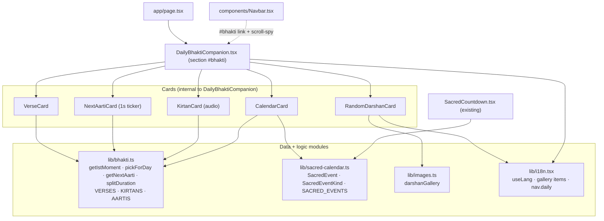
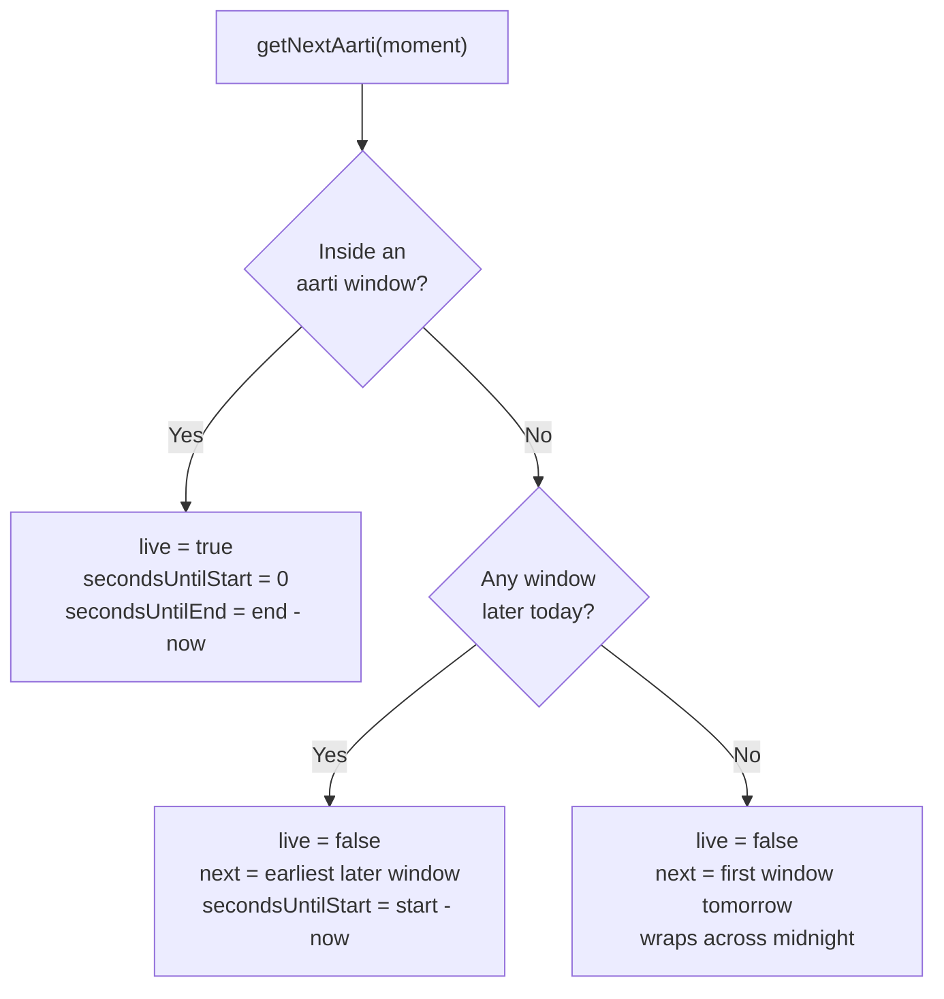
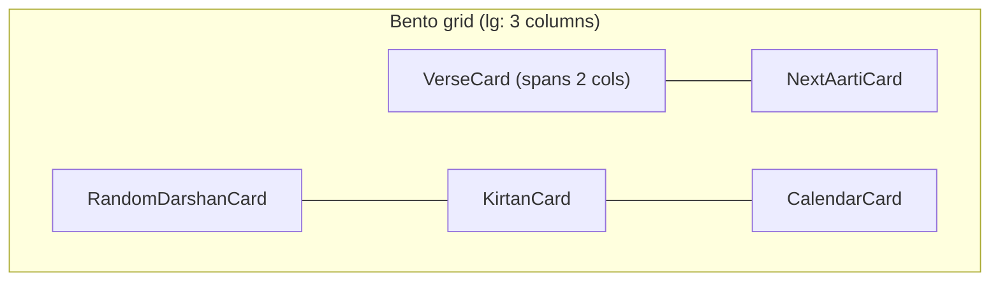

# Design Document — Daily Bhakti Companion

> Design-first documentation of a feature that is already implemented in the codebase. It records the architecture, interfaces, and rationale as they exist today so we can iterate on the design. Requirements and tasks phases can follow later. Requirement IDs referenced in the Correctness Properties section are provisional (prefixed `R`) and will be reconciled when `requirements.md` is authored.

## Overview

A single, premium home-page section that gathers five daily devotional touchpoints into one calm, cohesive bento interface:

1. **Random Darshan** — a rotating sacred image from the temple gallery.
2. **Verse of the Day** — a Gītā/śāstra śloka with Sanskrit, IAST transliteration, and translation.
3. **Kīrtana of the Day** — a traditional bhajan with lyrics, meaning, and (where available) audio.
4. **Vaiṣṇava Calendar** — the next upcoming observances (Ekādaśīs, festivals, appearance/disappearance days).
5. **Next Aarti Countdown** — a live per-second countdown to the next temple aarti.

The design goal is to bring all five together in a beautifully designed premium interface that matches the existing site's devotional visual language (maroon/gold, lotus motifs, restrained motion), fully bilingual (English/Hindi), and reduced-motion aware.

### Design Principles

- **Temple time is the single source of truth.** Everything that rotates daily or counts down is anchored to Jalandhar time (IST, `Asia/Kolkata`), not the visitor's clock, so every devotee sees the same verse/kīrtana/aarti status for a given temple-day.
- **Deterministic, not random-per-visitor.** Verse and kīrtana of the day are chosen by a pure function of the IST day number — reproducible, cache-safe, and identical across visitors.
- **Graceful by default.** Missing photos fall back to elegant themed placeholders; missing audio degrades to a "sing along" prompt; the section never looks broken.
- **Match the vibe.** Reuse existing primitives (`SectionHeading`, `Reveal`/`Stagger`, `FallbackImage`, palette tokens, `pattern-floral`) rather than inventing a new visual system.

### Goals

- One discoverable section (also linked from the navbar) combining all five widgets.
- Accurate, reviewable devotional content the temple can update in one place.
- No hydration mismatches despite time-based content on a statically-built site.
- Bilingual and reduced-motion aware, consistent with the rest of the site.

### Non-Goals

- No backend, database, or CMS; content is authored in typed TypeScript modules.
- No user accounts, personalization, or persistence.
- No live-streaming video (the existing Live Darshan covers broadcast windows).
- No astronomical tithi computation — calendar dates are curated from the authoritative printed Gauḍīya Vaiṣṇava calendar and stored as a reviewable list.

## Architecture

The feature is a self-contained client section backed by two typed data/logic modules, reusing the site's UI primitives and i18n context.

- `app/page.tsx` mounts `<DailyBhaktiCompanion />` (section `#bhakti`).
- `components/Navbar.tsx` provides the `#bhakti` link and scroll-spy.
- `DailyBhaktiCompanion.tsx` contains five cards: `VerseCard`, `NextAartiCard` (per-second ticker), `RandomDarshanCard`, `KirtanCard` (audio), `CalendarCard`.
- `lib/bhakti.ts` provides the IST time model, the deterministic picker, aarti logic, and content (`VERSES`, `KIRTANS`, `AARTIS`).
- `lib/sacred-calendar.ts` provides `SacredEvent` / `SacredEventKind` / `SACRED_EVENTS` (also consumed by the existing `SacredCountdown`).
- `lib/images.ts` (`darshanGallery`) and `lib/i18n.tsx` (gallery items, `useLang`) support `RandomDarshanCard`.



### Module Responsibilities

- **`lib/bhakti.ts`** — Time model (`getIstMoment`), deterministic picker (`pickForDay`), duration math (`splitDuration`), content (`VERSES`, `KIRTANS`), and the aarti schedule (`AARTIS`) with `getNextAarti`. Pure and framework-free.
- **`lib/sacred-calendar.ts`** — the curated Vaiṣṇava calendar (`SacredEvent` type, `SacredEventKind` union, `SACRED_EVENTS` list); shared with `SacredCountdown`.
- **`components/features/DailyBhaktiCompanion.tsx`** — the section shell, the five cards, and local bilingual UI strings; all time/randomness lives in `useEffect` (client-only).
- **`app/page.tsx`** — mounts the section between the Darshan/harinam band and About.
- **`components/Navbar.tsx`** — the daily nav link → `#bhakti`, added to `SPY_TARGETS` and `HOME_DARK_SECTIONS`.
- **`lib/i18n.tsx`** — the `nav.daily` label in the `Dict` type plus `en` and `hi` values.

## The Time Model (Core Design Decision)

All daily rotation and countdown behavior derives from `getIstMoment(now)`, which projects any `Date` into Jalandhar wall-clock time using `Intl.DateTimeFormat` with `timeZone: "Asia/Kolkata"` — avoiding manual offset/DST math.

`IstMoment` fields:

- `year`, `month`, `day`, `hour`, `minute`, `second`
- `secondsSinceMidnight` — drives the aarti countdown
- `dayNumber = floor(UTC(y, m, d) / 86_400_000)` — advances at IST midnight and seeds daily content selection

A `try/catch` fallback uses the local date if the `Intl` named-zone is unavailable.

### Deterministic of-the-day selection

```ts
pickForDay<T>(items, dayNumber): T {
  const index = ((dayNumber % items.length) + items.length) % items.length;
  return items[index];
}
```

Pure and total: the same day plus the same list yields the same item for every visitor. The verse pool (10) and kīrtana pool (6) cycle independently.

### Next aarti resolution

`AARTIS` are stored as minutes-since-IST-midnight plus a duration: Maṅgala Ārati 05:00 (90 min) and Sandhyā Ārati 19:30 (90 min). `getNextAarti(moment)` returns `{ aarti, live, secondsUntilStart (0 while live), secondsUntilEnd (0 when not live) }`.

Resolution order:

1. Inside a window → `live`.
2. Earliest window later today.
3. First window tomorrow (wraps across midnight).

It always yields a valid target.



## Hydration Strategy

A static build means any build-time time value would be stale and cause a hydration mismatch, so all time/randomness stays out of the first render:

- The section holds `dayNumber: number | null`, initialized `null`, set in `useEffect` on mount, and refreshed every 60s (content rolls over at IST midnight without a reload).
- `NextAartiCard` holds `now: Date | null`, set on mount, ticking every 1s via `setInterval`.
- `RandomDarshanCard` picks its initial index in `useEffect`.
- Until mounted, cards render a localized "Preparing…" state.

Result: server HTML == first client render (loading state); live content appears post-mount. Only `NextAartiCard` re-renders each second; day-based cards re-render at most once per minute, memoized on `dayNumber`.

## Components and Interfaces

All cards are internal to `DailyBhaktiCompanion.tsx`; `lang: Lang` is passed as a prop, and day-based cards receive `dayNumber: number | null`.

- **`CardShell({ label, className?, children })`** — the shared glass frame (`border-gold/25`, `bg-white/[0.055]`, `backdrop-blur-md`), a gold top hairline, an uppercase eyebrow label, and a flex-column body so footers align to the bottom.
- **`VerseCard { lang, dayNumber }`** → `pickForDay(VERSES, dayNumber)`. Renders Devanāgarī Sanskrit, IAST, a divider, the translation (en/hi), and the reference. Spans two columns on `lg`.
- **`NextAartiCard { lang }`** — a self-contained per-second ticker; a live pulse dot when live; the aarti name; an Hrs/Min/Sec countdown (`splitDuration`); the static daily schedule; `role="timer"`.
- **`RandomDarshanCard { lang }`** — a random index into `darshanGallery`; an "Another darshan" button that reshuffles (guaranteed to change); `FallbackImage` for a graceful placeholder; a framer-motion cross-fade on change; a localized title/caption from `t.gallery.items[index]` falling back to the image's own fields.
- **`KirtanCard { lang, dayNumber }`** → `pickForDay(KIRTANS, dayNumber)`: lyrics, meaning, tradition; if `audioSrc` is present, play/pause drives a self-managed `<audio preload="none">` that resets when the day's kīrtana changes; otherwise a "sing along softly" prompt.
- **`CalendarCard { lang, dayNumber }`** — computes `daysUntil` per event via the IST `dayNumber`, filters to upcoming, and shows the next five; each row has a kind badge (a colored dot via `KIND_META`), a localized name, a formatted date (`Intl.DateTimeFormat`, `Asia/Kolkata`), and a relative label (Today/Tomorrow/in N days).

## Data Models

```ts
interface Verse {
  sanskrit: string;
  transliteration: string;
  en: string;
  hi: string;
  reference: string;
}

interface Kirtan {
  title: string;
  titleHi: string;
  tradition: string;
  traditionHi: string;
  lines: string[];
  meaning: string;
  meaningHi: string;
  audioSrc?: string;
}

interface Aarti {
  name: string;
  nameHi: string;
  minutes: number;          // minutes since IST midnight
  durationMinutes: number;
}

type SacredEventKind =
  | "ekadashi" | "festival" | "appearance" | "disappearance"
  | "purnima" | "amavasya" | "vrata" | "sankranti";

interface SacredEvent {
  name: string;
  nameHi: string;
  date: string;             // ISO with +05:30 offset
  kind: SacredEventKind;
  note: string;
  noteHi: string;
}
```

Notes:

- Content is authored in TypeScript for type safety plus zero-infra editing.
- `SACRED_EVENTS` holds 43 curated events (Jul 2026 → Gaura Pūrṇimā Mar 2027) transcribed from the printed Gauḍīya Vaiṣṇava calendar (Gaurābda 540). The `note`/`noteHi` fields are retained so the pre-existing `SacredCountdown` keeps working unchanged.
- `KIND_META` maps each kind to a bilingual label plus a Tailwind dot color for the calendar badges.

## Visual & Interaction Design

- **Section** — `id="bhakti"`, `data-section-mood="maroon"`, `bg-maroon-gradient`, a `pattern-floral` overlay, a top gold hairline, and a soft radial gold glow — consistent with the other dark sections.
- **Heading** — the existing `SectionHeading` (light variant), eyebrow "Nitya Sevā", with the shimmer-on-static-text treatment used site-wide.
- **Layout** — a responsive bento grid: `grid sm:grid-cols-2 lg:grid-cols-3`; `VerseCard` spans two columns so the top row reads Verse (wide) + Aarti (narrow), then Darshan / Kīrtana / Calendar.
- **Reveal** — `Stagger` + `StaggerItem` (the site's Lotus-Breath reveal) animate the cards in on scroll.
- **Buttons** — the gold-outline pill style that matches the existing CTAs.



## Cross-Cutting Concerns

### Accessibility

- The countdown container uses `role="timer"`; the live-indicator dot is `aria-hidden` with a text label alongside it.
- The audio toggle exposes `aria-pressed`; decorative glyphs are `aria-hidden`.
- Color pairings follow the site's maroon/cream/gold contrast usage.

### Reduced Motion

- `useReducedMotion()` disables the darshan cross-fade; `Reveal`/`Stagger` collapse to an instant "show"; the per-second countdown is a text update, not an animation.

### Internationalization

- Feature UI strings live in a local `UI = { en, hi }` object (mirroring `SacredCountdown`) to keep risk low on the large shared i18n dictionary; only `nav.daily` was added to the shared `Dict`.
- All content types carry `*Hi` fields; the active language is read from `useLang()`.

### Error Handling / Graceful Degradation

- Missing images → `FallbackImage` themed lotus-mandala placeholder.
- Missing audio → the "sing along" prompt; audio errors reset the play state.
- `getIstMoment` falls back to local time if `Intl` timezone data is unavailable.
- An empty upcoming-events list (past the last curated date) shows loading/placeholder copy rather than an empty box (flagged as an annual-maintenance item).

### Performance

- Only `NextAartiCard` re-renders per second; day-based cards memoize on `dayNumber` (≤ 1/min); audio uses `preload="none"`; the darshan image reuses the shared lazy `FallbackImage`.

## Integration Points

- **`app/page.tsx`** — `<DailyBhaktiCompanion />` is inserted between the harinam `QuoteBand`'s `CeremonialDivider` and the About section, wrapped by dividers.
- **`components/Navbar.tsx`** — `NavKey` gains `"daily"`; `LINKS` gains `{ key: "daily", target: "#bhakti" }` after Home; `#bhakti` is added to `SPY_TARGETS` (active-link scroll-spy) and `HOME_DARK_SECTIONS` (keeps nav text light over the dark section).
- **`lib/i18n.tsx`** — `nav.daily = "Daily Bhakti"` / `"नित्य भक्ति"`.

## Correctness Properties

*A property is a characteristic or behavior that should hold true across all valid executions of a system — essentially, a formal statement about what the system should do. Properties serve as the bridge between human-readable specifications and machine-verifiable correctness guarantees.*

> Requirement IDs below are provisional (`R1`–`R8`) and map to the functional areas named in this design. They will be reconciled with `requirements.md` when the requirements phase runs. Provisional areas: **R1** Verse of the Day, **R2** Kīrtana of the Day, **R3** Random Darshan, **R4** Vaiṣṇava Calendar, **R5** Next Aarti Countdown, **R6** Temple-time model, **R7** Hydration safety, **R8** i18n & reduced motion.

### Property 1: Deterministic of-the-day selection

*For any* non-empty content pool and *any* integer day number (including negative or very large values), `pickForDay` returns an element that is a member of the pool, and returns the identical element for equal day numbers — so every visitor sees the same verse and kīrtana for a given temple-day.

**Validates: Requirements R1.1, R2.1, R6.1**

### Property 2: Selection cycles through the whole pool

*For any* non-empty pool, applying `pickForDay` across any run of consecutive day numbers whose length equals the pool size yields every element exactly once (the index map is a bijection over one cycle).

**Validates: Requirements R1.1, R2.1**

### Property 3: Reshuffle always changes the darshan

*For any* current index into a gallery of two or more images, the shuffle action returns a different index than the current one.

**Validates: Requirements R3.1**

### Property 4: Calendar shows only upcoming observances, in order, capped at five

*For any* temple-day number and *any* event list, the calendar's output contains only events whose IST day number is greater than or equal to the current day number, preserves the source chronological order, and has length `min(5, upcomingCount)`.

**Validates: Requirements R4.1**

### Property 5: Next-aarti resolution is always valid and consistent

*For any* IST moment, `getNextAarti` returns a schedule entry such that: `live` is true if and only if the moment lies within some aarti window; `secondsUntilStart == 0` exactly when `live` (and is positive otherwise); `secondsUntilEnd == 0` exactly when not `live`; and the returned target is the nearest currently-live-or-upcoming window, wrapping to tomorrow's first aarti after the last window of the day.

**Validates: Requirements R5.1**

### Property 6: Duration decomposition is exact and clamped

*For any* real number of seconds, `splitDuration` clamps negatives to zero and its components satisfy `days*86400 + hours*3600 + minutes*60 + seconds == floor(max(0, input))`, with `hours` in `[0,24)` and `minutes`, `seconds` in `[0,60)`.

**Validates: Requirements R5.2**

### Property 7: IST moment reflects the temple wall clock

*For any* `Date` instant, `getIstMoment` returns calendar/time fields equal to the `Asia/Kolkata` projection of that instant, with `secondsSinceMidnight == hour*3600 + minute*60 + second` and lying in `[0, 86400)`.

**Validates: Requirements R6.1**

### Property 8: Temple-day number is stable within a day and increments across IST midnight

*For any* two instants within the same IST calendar day, `dayNumber` is equal; and *for any* instant, an instant one IST day later has a `dayNumber` greater by exactly one.

**Validates: Requirements R6.2**

### Property 9: Pre-mount render is time-independent (hydration safety)

*For any* language and *any* build-time clock value, the first render (before mount) produces the localized "Preparing…" loading state for every day-based card — identical to the server-rendered HTML — so no time-derived content appears until after mount.

**Validates: Requirements R7.1**

## Testing Strategy

The pure logic in `lib/bhakti.ts` is the highest-value test surface:

- **`pickForDay`** — determinism (same day ⇒ same item), full-cycle coverage, negative/large `dayNumber` wrap-around. *(Properties 1, 2)*
- **`getIstMoment`** — known UTC instants map to expected IST fields plus `dayNumber`; the midnight-rollover boundary; the fallback path. *(Properties 7, 8)*
- **`getNextAarti`** — before the first aarti, inside a window (live), between windows, after the last window (wrap to tomorrow), and exact boundary seconds. *(Property 5)*
- **`splitDuration`** — hours/minutes/seconds decomposition and clamping at 0. *(Property 6)*

Component-level: render-with-mock-clock verifies that the pre-mount render shows the loading state (hydration safety, *Property 9*) and that the post-mount render shows content; also verify bilingual switching and reduced-motion behavior. Manual QA in Chromium (the site's tested target) covers layout, motion, and audio.

**Property test configuration:** a minimum of 100 iterations per property test; each property test references its design-document property using the tag format **Feature: daily-bhakti-companion, Property {number}: {property_text}**.

## Open Questions / Future Considerations

- **Calendar longevity** — `SACRED_EVENTS` ends at Gaura Pūrṇimā (Mar 2027); decide the annual refresh process and the desired empty-state once all dates are past.
- **Audio library** — only the mahāmantra currently has an `audioSrc`; more recordings could be added.
- **Verse/kīrtana breadth** — the pools (10/6) can grow; selection scales automatically.
- **Localization depth** — whether to migrate the local `UI` strings into the shared dictionary later.
