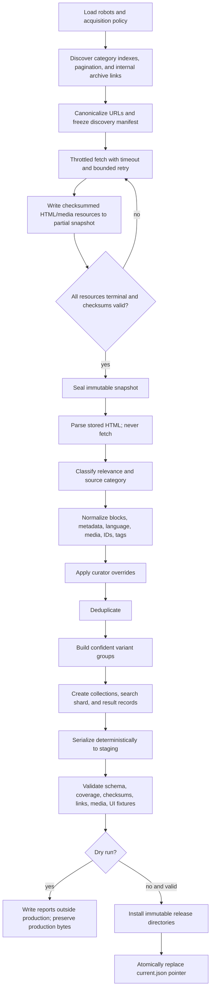
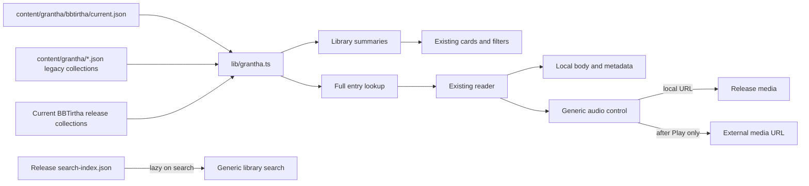

# Design Document

## 1. Overview

This design adds a manually initiated, one-time BBTirtha archive import to the existing Grantha Mandir ingestion and reading system. Acquisition is isolated from production rendering: permitted source pages and media are first captured in a sealed local snapshot, and every normalized collection, report, search artifact, and promoted media file is derived from that snapshot. Production continues to render JSON-backed local content through the existing cards, reader route, bookmarks, reading progress, previous/next navigation, related-content ranking, sharing, and audio controls.

The design makes four decisions central:

1. **Acquisition and normalization are separate phases.** Network access is allowed only while building or validating a snapshot. Normalization is an offline, deterministic transformation.
2. **BBTirtha is a source adapter, not a frontend mode.** The adapter emits the shared Grantha contract. No route or component imports BBTirtha code or switches on the BBTirtha hostname.
3. **A release pointer is the publication boundary.** New output is written to immutable, content-addressed release directories, validated there, and made active by one atomic pointer replacement.
4. **All schema additions are optional for legacy content.** Absence of new fields preserves current rendering and behavior.

The source adapter version for the first implementation is `bbtirtha-adapter/1.0.0`. That value participates in deterministic output and provenance.

## 2. Existing Architecture and Integration Points

The current system has the required seams:

- `scripts/ingest/run.mjs` selects source adapters and supports `--dry`.
- `scripts/ingest/core/*` normalizes, classifies, and serializes source output.
- `content/grantha/*.json` is loaded by `lib/grantha.ts`.
- `GranthaCollection`, `Article`, and `ArticleBlock` are client-safe types in `lib/grantha-types.ts`.
- `LibraryContent`, `ArticleCard`, `ReadingContent`, `CollectionContent`, and `AudioPlayer` provide the presentation baseline.
- `lib/grantha-store.tsx` persists bookmarks, continue-reading state, and streak data by stable article slug.
- `/grantha-mandir/read/[slug]` provides stable local reader routes and static generation.

The import extends these seams rather than creating an origin-specific route or application area.

## 3. Architecture

### 3.1 System Context

```mermaid
flowchart LR
    Curator[Curator] -->|manual commands| CLI[BBTirtha one-time CLI]
    Site[bbtirtha.org public archive] -->|policy-gated HTTPS| Acquisition[Discovery and acquisition]
    Policy[robots.txt + acquisition-policy.json] --> Acquisition
    Acquisition --> Work[Resumable partial workspace]
    Work --> Seal[Snapshot sealer]
    Seal --> Snapshot[Immutable source snapshot]
    Overrides[Version-controlled curator overrides] --> Adapter[BBTirtha source adapter]
    Snapshot --> Adapter
    Adapter --> Core[Shared Grantha normalization core]
    Core --> Stage[Immutable staged release]
    Stage --> Reports[JSON + Markdown reports]
    Stage --> Validation[Schema, coverage, link, media, deterministic validation]
    Validation -->|all gates pass| Promote[Atomic release-pointer promotion]
    Promote --> LocalJSON[Local Grantha JSON]
    Promote --> LocalMedia[Local permitted media]
    Promote --> SearchShard[Lazy search-index shard]
    LocalJSON --> Data[lib/grantha.ts]
    SearchShard --> Library[Existing Grantha library]
    Data --> Library
    Data --> Reader[Existing Grantha reader]
    LocalMedia --> Player[Generic audio player]
    ExternalMedia[Permitted external media] -->|user-initiated playback only| Player
```



### 3.2 Import Data Flow



### 3.3 Runtime Data Flow



## 4. Manual Commands and Phase Boundaries

Acquisition is exposed by a dedicated source CLI because the existing `Source.collect()` contract should not perform an implicit crawl during normal ingestion.

```text
# 1. Discover archive records and create a resumable partial workspace
node scripts/ingest/sources/bbtirtha/cli.mjs discover --work-id=<curator-id>

# 2. Acquire remaining permitted resources and seal a snapshot
node scripts/ingest/sources/bbtirtha/cli.mjs snapshot --work-id=<curator-id> --resume

# 3. Normalize the sealed snapshot without touching production
node scripts/ingest/run.mjs --source=bbtirtha --snapshot=<snapshot-id> --dry

# 4. Curator edits version-controlled overrides and repeats dry run
node scripts/ingest/run.mjs --source=bbtirtha --snapshot=<snapshot-id> --dry

# 5. Validate and atomically write local output
node scripts/ingest/run.mjs --source=bbtirtha --snapshot=<snapshot-id>
```

`--snapshot` is mandatory for this source. The BBTirtha adapter never chooses “latest” implicitly. The ordinary runner continues accepting legacy adapters that return `RawCollection[]`; it passes an optional context argument that existing JavaScript functions may ignore. Dry mode still executes finalization, serialization, schema validation, report generation, and release planning; it skips only installation and pointer replacement.

There is no scheduler, webhook, build hook, runtime refresh, deployment command, or recurring synchronization behavior.

## 5. Proposed Module Boundaries

### 5.1 BBTirtha Source Modules

| Module | Responsibility | Must not do |
|---|---|---|
| `sources/bbtirtha/cli.mjs` | Parse explicit `discover`/`snapshot` commands and coordinate phases. | Normalize or promote production content. |
| `sources/bbtirtha/config.mjs` | Load fixed origin, category registry, policy paths, limits, and adapter version. | Read source HTML or UI code. |
| `sources/bbtirtha/discover.mjs` | Deterministic frontier traversal, archive-link eligibility, pagination, and manifest item creation. | Decide normalized IDs or tags. |
| `sources/bbtirtha/policy.mjs` | Combine robots directives, exact host/path policy, terms/permission record, redirect checks, and access-restriction decisions. | Fetch a URL after returning deny. |
| `sources/bbtirtha/fetch-queue.mjs` | Per-host concurrency one, request-start spacing, timeout, Retry-After, and three-attempt limit. | Parse HTML or mutate normalized output. |
| `sources/bbtirtha/snapshot-store.mjs` | Atomic partial-state writes, content-addressed resource storage, checksum verification, resume, and sealing. | Modify a sealed snapshot. |
| `sources/bbtirtha/page-signals.mjs` | Extract canonical URL, source IDs, taxonomy, dates, attributions, language evidence, JSON-LD, template signals, and links. | Decide final content blocks. |
| `sources/bbtirtha/relevance.mjs` | Apply ordered access/operational/listing/relevance rules and stable reason codes. | Filter by teacher or author. |
| `sources/bbtirtha/parse-html.mjs` | Convert the selected teaching root to structured blocks in source order. | Execute scripts or emit HTML. |
| `sources/bbtirtha/media.mjs` | Resolve audio candidates, policy/mirror decisions, MIME verification, local paths, and external references. | Generate transcripts or autoplay media. |
| `sources/bbtirtha/language.mjs` | Apply override/source/script evidence precedence and return a normalized code/label. | Translate or transliterate text. |
| `sources/bbtirtha/identity.mjs` | Canonical URL normalization, Stable Entry IDs, slugs, fingerprints, and canonical duplicate selection. | Use mutable run timestamps. |
| `sources/bbtirtha/variants.mjs` | Build groups only from approved evidence and emit stable group IDs. | Group by title similarity alone. |
| `sources/bbtirtha/map-entry.mjs` | Map source category to Grantha kind, normalize metadata, blocks, availability, and provenance into `RawArticle`. | Write files or import React. |
| `sources/bbtirtha/index.mjs` | Shared source-adapter entry point that reads one sealed snapshot and emits the generic source result. | Access the network. |

### 5.2 Shared Ingestion Modules

| Module | Change |
|---|---|
| `core/types.mjs` | Add optional rich metadata/media/block JSDoc and source context/result contracts. |
| `core/classify.mjs` | Move tag phrases to checked configuration, normalize Unicode matching, enforce vocabulary, and preserve curator replacement semantics. |
| `core/normalize.mjs` | Add fidelity whitespace normalization, rich-text flattening, search flattening, and deterministic excerpt helpers. |
| `core/finalize.mjs` | Purely finalize collections/articles without time or filesystem access. |
| `core/deterministic-json.mjs` | Fixed key order, array-order assertions, LF/UTF-8 serialization, and SHA-256 helpers. |
| `core/stage-release.mjs` | Write a complete release to a same-filesystem staging directory and compute its file manifest. |
| `core/validate-release.mjs` | Schema, uniqueness, coverage, checksum, media, and pointer-target validation. |
| `core/promote-release.mjs` | Install immutable release directories and atomically replace only the active pointer. |
| `core/report.mjs` | Produce JSON and Markdown from one immutable result-record array. |
| `core/search-index.mjs` | Produce a generic, lazy-loadable search shard from normalized entries. |

`write-collection.mjs` remains as a compatibility wrapper over pure finalization plus deterministic serialization. BBTirtha uses the staged release path, not direct per-file writes.

### 5.3 Generic Runtime Modules

| Module | Generic enhancement |
|---|---|
| `lib/grantha-types.ts` | Optional v2 schema, list/rich-text blocks, and resolved runtime metadata types. |
| `lib/grantha.ts` | Load legacy root JSON plus the release named by `bbtirtha/current.json`; expose summaries separately from full blocks; resolve media/availability defaults. |
| `lib/grantha-search.ts` | Shared text normalization and query matching for inline legacy documents and lazy index shards. |
| `components/grantha/ArticleCard.tsx` | Optional language/availability metadata and “Listen” label for audio-only entries. |
| `components/grantha/ReadingContent.tsx` | Generic provenance, language, source category, attributions, variants, lists/runs, audio-first state, and media-error state. |
| `components/grantha/AudioPlayer.tsx` | Accept a `MediaReference`, defer external `src` assignment until activation, expose error/download state, and retain current controls. |
| `components/grantha/LibraryContent.tsx` | Use article summaries, lazy search shards, and progressive result rendering while preserving filters/cards. |

No module under `app/`, `components/`, or `lib/` may import `scripts/ingest/sources/bbtirtha/*` or branch on `bbtirtha.org`.

## 6. Backward-Compatible Schema

### 6.1 TypeScript Contract

The following is the exact v2 addition to `lib/grantha-types.ts`. Every entry-level field is optional so existing JSON remains valid. New BBTirtha collections set `schemaVersion: 2` and all semantically required imported fields.

```ts
export type SourceCategory =
  | "Harikatha"
  | "Article"
  | "Chapter"
  | "Kirtan"
  | "Audio"
  | "Letter"
  | "Blog";

export type ContentAvailability =
  | "text"
  | "text-and-audio"
  | "audio-only"
  | "media-unavailable";

export interface ContentLanguage {
  /** Normalized BCP-47 language tag, or "und". */
  code: string;
  label: string;
}

export type AttributionRole =
  | "author"
  | "speaker"
  | "translator"
  | "contributor"
  | "source-unattributed";

export interface ContentAttribution {
  role: AttributionRole;
  name: string;
}

export type SourceDatePrecision = "day" | "month" | "year" | "verbatim";

export interface SourceDate {
  /** Source date after deterministic whitespace normalization only. */
  value: string;
  /** YYYY, YYYY-MM, or YYYY-MM-DD when the source value is unambiguous. */
  iso?: string;
  precision: SourceDatePrecision;
}

export interface IngestionProvenance {
  origin: "https://bbtirtha.org" | string;
  canonicalSourceUrl: string;
  stableSourceId?: string;
  snapshotId: string;
  acquiredAt: string;
  adapterVersion: string;
}

export type MediaKind = "audio";
export type MediaRole = "primary" | "alternate";
export type MediaLocation = "local" | "external";

export interface MediaReference {
  /** media:sha256:<64 lowercase hex characters> */
  id: string;
  kind: MediaKind;
  role: MediaRole;
  location: MediaLocation;
  /** Local root-relative URL or permitted absolute HTTPS URL. */
  url: string;
  /** Canonical source-hosted URL from which this reference was obtained. */
  sourceUrl: string;
  mimeType?: string;
  /** Present for locally mirrored bytes. */
  checksum?: `sha256:${string}`;
  byteLength?: number;
  durationSeconds?: number;
  /** True only when source evidence/policy explicitly permits download. */
  downloadable: boolean;
}

export type InlineMark = "emphasis" | "strong";

export interface InlineRun {
  text: string;
  marks?: InlineMark[];
}

export interface RichText {
  /** Plain text equal to runs.map(run => run.text).join(""). */
  text: string;
  runs?: InlineRun[];
}

export interface ListItem extends RichText {
  children?: ListBlock[];
}

export interface ListBlock {
  type: "list";
  ordered: boolean;
  start?: number;
  items: ListItem[];
}

// Existing BlockType gains "list".
export type BlockType =
  | "paragraph"
  | "heading"
  | "verse"
  | "poem"
  | "quote"
  | "divider"
  | "list";

// Existing TextBlock keeps text and gains optional rich runs and level 4.
export interface TextBlock extends RichText {
  type: "paragraph" | "heading" | "quote";
  level?: 2 | 3 | 4;
  attribution?: string;
  attributionRuns?: InlineRun[];
}

export type ArticleBlock =
  | VerseBlock
  | PoemBlock
  | TextBlock
  | DividerBlock
  | ListBlock;

export interface Article {
  slug: string;
  title: string;
  author: string;
  published?: string;
  category: string;
  tags: string[];
  excerpt: string;
  description?: string;
  cover?: string;
  /** Legacy audio field; retained and resolved when media is absent. */
  audioUrl?: string;
  blocks: ArticleBlock[];

  /** v2 fields; optional so v1/legacy JSON remains valid. */
  stableEntryId?: string;
  sourceCategory?: SourceCategory;
  language?: ContentLanguage;
  attributions?: ContentAttribution[];
  sourceDate?: SourceDate;
  contentAvailability?: ContentAvailability;
  media?: MediaReference[];
  variantGroupId?: string;
  provenance?: IngestionProvenance;
}

export interface GranthaCollection {
  /** Absent means legacy v1; imported collections set 2. */
  schemaVersion?: 2;
  slug: string;
  kind: ContentKind;
  title: string;
  subtitle?: string;
  description: string;
  year?: string;
  issue?: string;
  cover?: string;
  pdfUrl?: string;
  pdfLabel?: string;
  featured?: boolean;
  addedAt?: string;
  articles: Article[];
}

export interface ArticleRef extends Article {
  collectionSlug: string;
  collectionTitle: string;
  kind: ContentKind;
  readingMinutes: number;
  pdfUrl?: string;
  /** Resolved from v2 metadata or legacy fields by the data layer. */
  resolvedAvailability: ContentAvailability;
  primaryMedia?: MediaReference;
}

export type ArticleSummary = Omit<ArticleRef, "blocks">;
```

`VerseBlock` remains unchanged because its four existing fields already represent original script, transliteration, translation, and reference separately. `PoemBlock` remains unchanged. The only new block type is `list`; rich inline runs are added only where required to preserve meaningful emphasis.

### 6.2 JSDoc Ingestion Contract

The exact corresponding additions to `scripts/ingest/core/types.mjs` are:

```js
/** @typedef {"Harikatha"|"Article"|"Chapter"|"Kirtan"|"Audio"|"Letter"|"Blog"} SourceCategory */
/** @typedef {"text"|"text-and-audio"|"audio-only"|"media-unavailable"} ContentAvailability */
/** @typedef {"author"|"speaker"|"translator"|"contributor"|"source-unattributed"} AttributionRole */
/** @typedef {{ code: string, label: string }} ContentLanguage */
/** @typedef {{ role: AttributionRole, name: string }} ContentAttribution */
/** @typedef {{ value: string, iso?: string, precision: "day"|"month"|"year"|"verbatim" }} SourceDate */
/** @typedef {{ origin: string, canonicalSourceUrl: string, stableSourceId?: string, snapshotId: string, acquiredAt: string, adapterVersion: string }} IngestionProvenance */
/** @typedef {{ text: string, marks?: ("emphasis"|"strong")[] }} InlineRun */
/** @typedef {{ text: string, runs?: InlineRun[], children?: RawListBlock[] }} RawListItem */
/** @typedef {{ type: "list", ordered: boolean, start?: number, items: RawListItem[] }} RawListBlock */
/**
 * @typedef {Object} MediaReference
 * @property {string} id
 * @property {"audio"} kind
 * @property {"primary"|"alternate"} role
 * @property {"local"|"external"} location
 * @property {string} url
 * @property {string} sourceUrl
 * @property {string} [mimeType]
 * @property {string} [checksum]
 * @property {number} [byteLength]
 * @property {number} [durationSeconds]
 * @property {boolean} downloadable
 */
/**
 * @typedef {Object} RawBlock
 * @property {"paragraph"|"heading"|"verse"|"poem"|"quote"|"divider"|"list"} type
 * @property {string} [text]
 * @property {InlineRun[]} [runs]
 * @property {2|3|4} [level]
 * @property {string} [attribution]
 * @property {InlineRun[]} [attributionRuns]
 * @property {string} [sanskrit]
 * @property {string} [transliteration]
 * @property {string} [translation]
 * @property {string} [reference]
 * @property {string} [speaker]
 * @property {string[]} [lines]
 * @property {boolean} [ordered]
 * @property {number} [start]
 * @property {RawListItem[]} [items]
 */
/**
 * @typedef {Object} RawArticle
 * @property {string} [slug]
 * @property {string} title
 * @property {string} [author]
 * @property {string} [published]
 * @property {string} [category]
 * @property {string[]} [tags]
 * @property {string} [excerpt]
 * @property {string} [description]
 * @property {string} [cover]
 * @property {string} [audioUrl]
 * @property {RawBlock[]} blocks
 * @property {string} [stableEntryId]
 * @property {SourceCategory} [sourceCategory]
 * @property {ContentLanguage} [language]
 * @property {ContentAttribution[]} [attributions]
 * @property {SourceDate} [sourceDate]
 * @property {ContentAvailability} [contentAvailability]
 * @property {MediaReference[]} [media]
 * @property {string} [variantGroupId]
 * @property {IngestionProvenance} [provenance]
 */
/**
 * @typedef {Object} SourceContext
 * @property {boolean} dryRun
 * @property {string} [snapshotId]
 * @property {string} runId
 * @property {string} stagingDir
 */
/** @typedef {{ collections: RawCollection[], artifacts?: { path: string, bytes: Uint8Array }[] }} SourceResult */
/**
 * @typedef {Object} Source
 * @property {string} id
 * @property {(context?: SourceContext) => Promise<RawCollection[]|SourceResult>} collect
 */
```

Existing source functions remain valid because JavaScript ignores the extra context argument and the runner treats a returned array as `{ collections: array }`.

### 6.3 Legacy Defaults

The data layer resolves absent v2 fields without mutating parsed JSON:

- `resolvedAvailability` is `text-and-audio` when legacy `blocks` and `audioUrl` exist, `audio-only` when only `audioUrl` exists, and `text` otherwise.
- `primaryMedia` is synthesized in memory from legacy `audioUrl`; it is never written back.
- Missing language, provenance, source category, variants, descriptions, and rich runs render nothing additional.
- Existing `author`, `published`, category, tags, excerpt, blocks, routes, and storage slugs remain authoritative.
- `estimateReadingMinutes` retains its current behavior. UI metadata hides reading time for resolved `audio-only` entries and uses duration or “Audio” instead; legacy text output is unchanged.

## 7. Filesystem Layouts

```text
content-sources/bbtirtha/
  config/
    acquisition-policy.json
    category-map.json
    tag-map.json
  overrides/
    overrides.v1.json
  work/
    <work-id>.partial/
      discovery-manifest.json
      acquisition-state.json
      frontier.json
      robots/
        bbtirtha.org.txt
        bbtirtha.org.meta.json
      resources/
        html/<sha256>.html
        media/<sha256>.<verified-extension>
      resource-records/
        <resource-key>.json
  snapshots/
    <snapshot-id>/
      snapshot.json
      discovery-manifest.json
      robots/
      resources/
        html/
        media/
      resource-records/
  staging/
    <run-id>/
      release/
        collections/
          01-harikatha.json
          02-article.json
          03-chapter.json
          04-kirtan.json
          05-audio.json
          06-letter.json
          07-blog.json
        search-index.json
        media/
        release-manifest.json
      reports/
        coverage.json
        coverage.md
        validation.json
        link-media-status.json
  reports/
    <run-id>/
      coverage.json
      coverage.md
      validation.json
      link-media-status.json

content/grantha/
  *.json                                  # unchanged legacy collections
  bbtirtha/
    current.json                          # only mutable BBTirtha production file
    releases/
      <release-id>/
        collections/*.json
        release-manifest.json

public/grantha/bbtirtha/releases/<release-id>/search-index.json
public/media/grantha/bbtirtha/releases/<release-id>/<sha256>.<ext>
```

A dry run may write only under `content-sources/bbtirtha/staging` and `reports`. It never writes under `content/grantha`, `public/grantha`, or `public/media`.

## 8. Manifest, Snapshot, Override, and Report Models

### 8.1 Discovery Manifest

```ts
type ArchiveItemType = "page" | "media-record";

type DiscoveryEvidence =
  | "configured-seed"
  | "robots-sitemap"
  | "archive-index"
  | "pagination"
  | "internal-archive-link";

interface DiscoveryManifestItem {
  manifestItemId: `item:sha256:${string}`;
  itemType: ArchiveItemType;
  discoveredUrl: string;
  canonicalUrl: string;
  discoveredFrom: string[];
  evidence: DiscoveryEvidence[];
  categoryHint?: SourceCategory;
  discoveryOrdinal: number;
  htmlResourceKey?: string;
  mediaResourceKeys?: string[];
}

interface DiscoveryManifest {
  schemaVersion: 1;
  origin: "https://bbtirtha.org";
  createdAt: string;
  policyChecksum: `sha256:${string}`;
  items: DiscoveryManifestItem[];
  checksum: `sha256:${string}`;
}
```

`discoveryOrdinal` is assigned only after the frontier closes, by sorting canonical URLs by Unicode code point. It does not depend on request completion order. A binary media resource linked from a page is a snapshot resource, not an additional Archive Item. It becomes a `media-record` Archive Item only when the source archive independently enumerates it as a teaching record.

### 8.2 Snapshot Seal

`snapshot.json` contains schema version, snapshot ID, origin, acquisition start/end timestamps, adapter version, exact policy/config checksums, discovery-manifest checksum, ordered resource count, ordered resource-root checksum, and `sealed: true`.

The snapshot ID is:

```text
bbtirtha-<UTC acquisition end YYYYMMDDTHHmmssZ>-<first 12 hex of manifest checksum>
```

A snapshot is built under `.partial`; sealing verifies every resource record and then renames the complete directory into `snapshots/<snapshot-id>`. All normalization code opens snapshots read-only and rejects `.partial`, `sealed !== true`, checksum mismatch, or adapter/config mismatch. Resuming a sealed snapshot is prohibited; a later source acquisition requires a new work ID and new snapshot.

### 8.3 Curator Overrides

`overrides.v1.json` is committed and deterministic:

```json
{
  "schemaVersion": 1,
  "entries": {
    "gm:bbtirtha:sha256:<64-hex>": {
      "sourceCategory": "Harikatha",
      "language": { "code": "en", "label": "English" },
      "attributions": [
        { "role": "speaker", "name": "Source-preserved name" }
      ],
      "tags": ["Bhakti", "Harinam"]
    }
  },
  "variantGroups": {
    "curator-work-key": {
      "members": [
        "gm:bbtirtha:sha256:<64-hex>",
        "gm:bbtirtha:sha256:<64-hex>"
      ],
      "reason": "Curator-approved translation relationship"
    }
  }
}
```

Entry keys are Stable Entry IDs. A canonical-URL alias may be accepted only by an explicit migration command that resolves and rewrites it to a Stable Entry ID; normal runs do not use fuzzy selectors. Tags replace automatic tags. Source-category overrides are applied before kind mapping. Language, attributions, and variant assignments replace automatic values. Unknown IDs, duplicate group membership, invalid tags, one-member groups, or conflicting overrides fail validation.

### 8.4 Coverage Result Record

```ts
type TerminalOutcome = "imported" | "skipped" | "duplicate" | "failed";
type GroupingDisposition = "ungrouped" | "variant-member" | "duplicate-of";

interface CoverageResultRecord {
  manifestItemId: string;
  sourceUrl: string;
  stableSourceId?: string;
  sourceCategory?: SourceCategory;
  language: ContentLanguage;
  attributions: ContentAttribution[];
  terminalOutcome: TerminalOutcome;
  groupingDisposition: GroupingDisposition;
  reasonCode?: string;
  reasonDetail?: string;
  stableEntryId?: string;
  relatedStableEntryId?: string;
  variantGroupId?: string;
}
```

Exactly one record exists per manifest item. `relatedStableEntryId` is mandatory for `duplicate-of`. A variant member remains `imported`; grouping is counted independently. JSON and Markdown reports consume the same frozen, sorted array.

## 9. Deterministic Serialization, Ordering, and Checksums

1. All text files use UTF-8 without BOM, LF endings, two-space indentation, and one final newline.
2. Objects are constructed in documented schema-key order; arbitrary maps are converted to sorted key/value arrays before serialization.
3. Sorting uses Unicode code-point comparison, never locale-sensitive collation.
4. Collection order is fixed: Harikatha, Article, Chapter, Kirtan, Audio, Letter, Blog.
5. Entries within a collection sort by source date ascending (`YYYY-MM-DD`, `YYYY-MM`, `YYYY`; unknown last), then normalized title, canonical source URL, and Stable Entry ID.
6. Source-order arrays are never sorted: blocks, verse parts, inline runs, list items, and source attributions retain source order.
7. Tags sort by `TAG_VOCABULARY` order. Media sort primary before alternate, then source order, then canonical media URL. Variant members sort by Stable Entry ID.
8. No output field uses current time during normalization. `acquiredAt` and `addedAt` derive from the sealed snapshot. Operational logs may contain current time but are not normalized artifacts.
9. Resource checksum is SHA-256 of exact response bytes. It is written as `sha256:<64 lowercase hex>`.
10. Manifest checksum is SHA-256 of canonical serialized manifest content with the `checksum` field omitted.
11. Release checksum is SHA-256 of concatenated sorted records: `<relative-path>\0<sha256>\0<byte-length>\n`.
12. `release-id` is `bbtirtha-<first 20 hex of release checksum>`. Identical inputs therefore address the same release.

## 10. Discovery and Relevance Algorithms

### 10.1 URL Discovery

Discovery starts from `https://bbtirtha.org/`, every sitemap declared by the acquired robots file, and any curator-approved archive seed in `acquisition-policy.json`. It then:

1. Canonicalizes and policy-checks each candidate before queueing.
2. Parses source taxonomy links whose normalized visible label or breadcrumb equals one of the seven Source Categories.
3. Traverses pagination links from recognized archive indexes.
4. Traverses same-origin links from the main content/listing root when they are detail links, category indexes, or archive pagination.
5. Records operational and listing pages reached through the archive, because they need terminal skipped outcomes.
6. Rejects fragments, mail/tel/javascript/data/blob URLs, feeds, search actions, share links, comment actions, and non-teaching binary assets from the page frontier.
7. Records audio URLs as resources of the owning item unless an archive index presents an audio record independently.
8. Sorts each newly discovered frontier level by canonical URL so concurrency cannot change the manifest.
9. Continues until the frontier is empty. Failure to find an index/equivalent record for any required Source Category is a fatal coverage validation error.

### 10.2 Canonical URL Normalization

The source-declared `<link rel="canonical">` is used only when it is HTTPS, policy-permitted, and on an allowed origin. Otherwise the final permitted response URL is used. Normalization lowercases scheme/host, removes default ports and fragments, resolves dot segments, collapses duplicate path separators, NFC-normalizes the path, percent-decodes only unreserved characters, preserves root `/`, removes a non-root trailing slash, removes known tracking/query-action parameters (`utm_*`, `fbclid`, `gclid`, `replytocom`, share, print, feed), and sorts remaining query pairs by key then value. Query parameters that identify source content are preserved.

### 10.3 Ordered Classification

Rules are applied in this order; the first terminal rule wins:

1. **Access restricted:** login form, HTTP 401/403, paywall/challenge marker, cookie/authentication requirement, or policy denial results in `skipped/access-restricted`. No bypass is attempted.
2. **Administrative:** admin/login/account/search/feed/API/action routes result in `skipped/operational-content`.
3. **Operational:** page taxonomy/template/title identifies calendar, event, announcement, organizational news, contact, donation, membership, privacy/terms, or site administration; result is `skipped/operational-content` even if incidental devotional quotations exist.
4. **Listing/non-content:** repeated archive cards or navigation dominate the selected root, no independent teaching body exists, and no standalone teaching audio exists; result is `skipped/non-content-page`.
5. **Relevant explicit category:** a supported source taxonomy/breadcrumb/category labels the page and it contains at least one independent source-authored teaching paragraph of 40 Unicode characters, two kirtan lyric lines, one structured verse/quote/list, or playable teaching audio; result proceeds to import.
6. **Relevant inherited category:** a detail page linked directly from a recognized category index may inherit that category when it has at least 80 teaching words or playable teaching audio and no conflicting taxonomy.
7. **Ambiguous:** conflicting categories, uncertain teaching root, or insufficient evidence produces `failed/classification-ambiguous`, not a silent skip. Promotion is blocked until parser/configuration or a curator override resolves it.
8. **Unrelated:** a permitted page that is neither teaching nor operational archive material receives `skipped/not-relevant-teaching` with evidence.

Attribution is never part of the relevance predicate. There is no teacher/author allowlist.

### 10.4 Source Category to Content Kind

| Source Category | Grantha `ContentKind` | Output collection |
|---|---|---|
| Harikatha | `lecture` | `01-harikatha.json` |
| Article | `article` | `02-article.json` |
| Chapter | `book` | `03-chapter.json` |
| Kirtan | `kirtan` | `04-kirtan.json` |
| Audio | `lecture` | `05-audio.json` |
| Letter | `article` | `06-letter.json` |
| Blog | `article` | `07-blog.json` |

The source category remains on each entry and is never replaced by the mapped kind or Grantha topic category.

## 11. Compliant, Throttled, and Resumable Acquisition

### 11.1 Policy Gate

`policy.mjs` evaluates every initial URL and every redirect target against:

- the stored robots rules for user agent `GranthaMandirArchiveImporter/1.0` and `*` fallback;
- exact HTTPS host allowlists (`bbtirtha.org`, normalized `www` alias, and separately approved media hosts);
- path allow/deny rules;
- a version-controlled permission/terms note and mirror authorization flag;
- no-auth/no-cookie/no-bypass rules;
- DNS/IP safety checks.

If robots cannot be acquired or parsed, discovery fails closed. A robots response is stored in the partial snapshot before other source requests. Redirects are limited to five and re-evaluated before following.

### 11.2 Scheduler

A queue exists per host. Each queue has one worker, records the last request start using a monotonic clock, and delays the next start until at least 1,000 ms has elapsed. Different explicitly allowed hosts may progress independently.

Every request uses `AbortController` with a 30,000 ms deadline. Network errors, 408, 429, and 5xx responses are retried with at most three total attempts. Delay before attempts two and three is respectively 1 and 4 seconds, raised to the parsed `Retry-After` delta/date when larger. Invalid `Retry-After` is ignored. Other 4xx responses are terminal. Requests do not send credentials, cookies, referers containing local data, or browser automation headers.

### 11.3 Snapshot Write and Resume

Response bytes stream to a same-directory temporary file while SHA-256 and byte length are computed. A configured compressed and decompressed size limit is enforced: 10 MiB for HTML/JSON and 500 MiB per audio resource. The temporary file is renamed to its content-addressed path only after completion and MIME checks.

`acquisition-state.json` is replaced atomically after each resource transition. A completed resource stores URL, final URL, status, HTTP metadata, attempts, MIME, byte length, checksum, relative path, and completion timestamp. Resume recomputes the on-disk checksum. A matching complete resource is not requested again; a missing/mismatched file returns to pending. All other terminal states retain their evidence and do not silently become success.

## 12. HTML Parsing and Media Resolution

### 12.1 Parser Choice and Trust Model

HTML is parsed with Cheerio in standards-compliant HTML mode. JSON-LD is parsed as data. Script, iframe, embed, object, style, form, template, noscript, navigation, header, footer, aside, cookie banner, sharing, comments, related-post cards, and administrative controls are removed from a cloned DOM. No script executes and no source HTML is passed to React or `dangerouslySetInnerHTML`.

### 12.2 Teaching Root Selection

Candidate roots use this score:

- `[itemprop="articleBody"]`: +100
- `article`: +80
- `.entry-content`, `.post-content`, `.article-content`, `.node-content`: +70
- `main`: +40
- explicit title/byline/date association: +20
- each independent paragraph/verse/list, capped at +30
- each repeated listing-card child: -10
- navigation/share/comment density above 30%: -40

The highest score wins; equal scores use DOM order. A score below 60 is ambiguous unless the page is a standalone audio record. Template fixtures lock the source selectors and scoring behavior. Source updates that break fixture fingerprints fail rather than falling through to broad body text.

### 12.3 Metadata Extraction Precedence

- **Title:** teaching-root heading, then JSON-LD headline, then Open Graph title, then document title with configured site suffix removed.
- **Canonical URL:** valid source canonical, then final response URL.
- **Stable source ID:** explicit source item/work metadata or stable machine identifier; a URL is not copied into this field.
- **Attributions:** ordered visible byline/credits, then JSON-LD author/contributor/translator; roles are preserved and exact duplicate role/name pairs collapse by first occurrence. Absence emits `{ role: "source-unattributed", name: "Source unattributed" }`.
- **Date:** visible publication/delivery date, then `datePublished`; source display value is retained and an ISO value is added only when unambiguous.
- **Description:** source-authored summary/deck/excerpt; no importer summary is generated.
- **Language evidence:** curator override, explicit item/root `lang`, source language metadata/label, then deterministic detector.
- **Category:** source taxonomy/breadcrumb/category badge, then inherited category-index evidence, then curator override replacement.

### 12.4 Block Conversion

The teaching root is walked depth-first in DOM order:

- `h2`/`h3`/`h4` become heading blocks at their level; the page `h1` is the article title and is not duplicated.
- `p` becomes paragraph unless it is inside a recognized quote, verse, or lyric container.
- `blockquote` becomes one quote block per source paragraph with source citation/attribution.
- `hr` and source ornamental separators become divider blocks.
- `ul`/`ol` become recursive list blocks; `start` is retained for ordered lists.
- recognized lyric/stanza containers and line breaks become poem blocks with source line boundaries.
- recognized verse containers map explicitly labeled original script, transliteration, translation, and reference fields; absent parts remain absent.
- `<em>`/`<i>` and `<strong>`/`<b>` inside teaching text create normalized inline runs. Adjacent runs with identical marks merge. Plain `text` always equals concatenated run text.
- links retain visible source text but not arbitrary source HTML attributes.
- non-breaking spaces become spaces; horizontal runs collapse; paragraph boundaries, line boundaries in verse/poem, Unicode code points, and source order remain.

The importer never supplies a missing transliteration, translation, attribution, transcript, or explanatory paragraph.

### 12.5 Audio and Media

Audio candidates are collected in source order from:

1. `<audio src>` and nested `<source>`;
2. JSON-LD `AudioObject.contentUrl`/`associatedMedia`;
3. explicit download/audio anchors with audio MIME or known audio extension;
4. static `data-src`/`data-audio` JSON attributes.

JavaScript is not executed and opaque player scripts are not reverse engineered. URLs are resolved against the canonical page, canonicalized, limited to HTTPS, and policy-checked. MIME is verified from response magic bytes for mirrored media; an HTML response masquerading as audio is rejected.

When mirroring is authorized and completes, the production URL is `/media/grantha/bbtirtha/releases/<release-id>/<sha256>.<ext>`, with checksum and byte length. If mirroring is unauthorized or fails but a stable permitted source URL exists, an external reference is emitted. `downloadable` is true only for an explicit source download affordance or policy permission. Multiple files remain separate media references; the first source primary candidate is `primary` and the rest are `alternate`.

Availability is derived by this total function:

| Source-authored/reviewed readable body | Playable media | Known media record but unavailable | Result |
|---|---|---|---|
| yes | no | no | `text` |
| yes | yes | no | `text-and-audio` |
| no | yes | no | `audio-only` |
| either | no | yes | `media-unavailable` |

A source description is metadata, not a transcript. It does not change an audio record from `audio-only`.

## 13. Normalization Algorithms

### 13.1 Stable Identity

Stable source IDs are trimmed and NFC-normalized but not case-folded. The Stable Entry ID is the full SHA-256 digest:

```text
if stableSourceId exists:
  gm:bbtirtha:sha256:<sha256("bbtirtha\0id\0" + stableSourceId)>
else:
  gm:bbtirtha:sha256:<sha256("bbtirtha\0url\0" + canonicalSourceUrl)>
```

Title, body, language, dates, and run time do not participate.

### 13.2 Slugs and Collisions

The base slug uses the existing ASCII `slugify(title)` on snapshot title data, capped at 68 characters. If empty, it uses the canonical URL’s final path segment; if still empty it uses `teaching`.

A global registry includes every legacy slug and every planned imported slug. Legacy slugs always retain ownership. If one imported entry has an unclaimed base, it receives the base. For an imported collision set, the lexicographically smallest Stable Entry ID receives an unclaimed base; all others receive `<base>--<first-12-hex-of-entry-id>`. If that suffix collides, it grows to 20 then 64 hex characters. The same snapshot/config/overrides therefore yields the same unique routes.

### 13.3 Duplicate Fingerprint and Canonical Selection

Duplicate evidence is applied in order:

1. equal non-empty Stable Source ID;
2. equal Canonical Source URL;
3. equal v1 content fingerprint.

The fingerprint is SHA-256 of canonical JSON containing language code, fidelity-normalized title, ordered role/name attributions, complete ordered blocks, and—for audio-only records—ordered canonical media source URLs. It does not use excerpt, tags, collection, snapshot timestamps, or slug.

Within a duplicate component, the canonical item is chosen by: detail-page template over listing/media alias; then greater count of source-authored block characters; then available media; then canonical URL; then manifest item ID. One entry is emitted. Every other Archive Item receives terminal outcome `duplicate`, disposition `duplicate-of`, and the canonical Stable Entry ID.

### 13.4 Variant Groups

Confident edges come only from:

- an explicit source “translation/other language/alternate recording” cross-reference;
- an explicit shared source work/group identifier distinct from the item identifier;
- a curator-approved override group.

Title similarity, date proximity, author equality, and content fingerprint similarity never create a variant edge. Duplicate components are resolved before variants. Connected components of at least two non-duplicate entries become groups.

Group IDs are:

```text
vg:bbtirtha:sha256:<sha256("source-work\0" + sourceWorkId)>
vg:bbtirtha:sha256:<sha256("override\0" + overrideGroupKey)>
vg:bbtirtha:sha256:<sha256("crosslink\0" + sortedStableEntryIds.join("\0"))>
```

Grouping writes only `variantGroupId`; it does not merge or replace content, media, attribution, language, date, provenance, slug, or Stable Entry ID.

### 13.5 Language Detection

Precedence is curator override, explicit source metadata, then deterministic detection. Explicit language tags are canonicalized as BCP-47; unknown valid tags retain their normalized code and a stable registry label. Detection examines title and substantial prose/lyrics, excluding original-script verse fields when a translation dominates the surrounding teaching.

A script result is accepted only with at least 40 letters and 80% dominance. Bengali maps to `bn`; unambiguous script-specific configured languages map to their BCP-47 code. Devanagari is not assumed to be Hindi or Sanskrit: deterministic Hindi/Sanskrit token models must have confidence at least 0.90 and margin at least 0.20. Latin-script English uses the same thresholds. Mixed or below-threshold evidence yields `{ code: "und", label: "Undetermined" }`. Detection never changes source text.

### 13.6 Topic Tags

Matching uses Unicode case-folded words with Latin-diacritic aliases, field weights, and exact phrase boundaries:

- source taxonomy/tag: 8
- title: 5
- heading: 3
- body occurrence: 1, capped at 3 per phrase

A tag requires score 5, or an explicitly configured unambiguous source taxonomy match. Results sort by score descending then vocabulary order, cap at six, and fall back to `Bhakti` only for otherwise relevant teaching with no match. Curator tags replace, rather than union with, automatic tags and must belong to the vocabulary.

The checked mapping covers every concept:

| Tag | Required configured phrases/aliases |
|---|---|
| Guru Tattva | guru, spiritual master, diksa/diksha, siksa/shiksha, acharya, gurudeva |
| Krishna | krishna/krsna, govinda, gopala, syamasundara, vrndavana/vrindavan, vraja |
| Radha | radha, radhika, radharani, srimati |
| Mahaprabhu | mahaprabhu, chaitanya/caitanya, gauranga, gaura, nimai, gaura-lila |
| Nityananda | nityananda, nitai |
| Harinam | harinam, holy name, nama, chanting, sankirtana, kirtana, maha-mantra |
| Bhakti | bhakti, devotion, devotional service, sadhana, prema, bhajana |
| Rasa | rasa, mellow, madhurya, vatsalya, sakhya, dasya, gopi |
| Jagannath | jagannatha/jagannath, puri, baladeva, subhadra |
| Rath Yatra | ratha-yatra/rath yatra/ratha yatra, chariot festival |
| Ekadashi | ekadasi/ekadashi, fasting, vrata |
| Festivals | festival, utsava, janmastami/janmashtami, gaura-purnima, kartika, vyasa-puja, appearance day, disappearance day |
| Srimad Bhagavatam | srimad-bhagavatam, srimad bhagavatam, bhagavata, bhagavatam |
| Bhagavad Gita | bhagavad-gita, bhagavad gita, gita |
| Chaitanya Charitamrita | caitanya-caritamrta, chaitanya charitamrita, caritamrta |
| Gaudiya History | gaudiya, gosvami, six gosvamis, parampara, lineage, gaudiya history |
| Vaisnava Etiquette | etiquette, vaisnava/vaishnava aparadha, offense, sadhu-sanga, humility |
| Questions & Answers | question and answer, questions & answers, q&a, reader asks, reply |

### 13.7 Excerpts and Dates

A source excerpt/description is preserved. Otherwise the excerpt is the first source-authored paragraph, quote, translation, list item, or poem text containing at least 40 characters, whitespace-normalized and truncated to 220 Unicode code points at the last word boundary with `…`. It never uses generated text.

The exact source date display value is stored in `sourceDate.value` and mirrored to legacy `published`. ISO and precision are added only when parsing is unambiguous. Unknown or conflicting date formats retain `precision: "verbatim"` and no ISO value.

## 14. Collection and Release Generation

Seven source-category collections are always planned in fixed order; empty collections are omitted from production but represented with zero totals in reports. Their titles are `BBTirtha — <Source Category>`, kinds use the mapping table, `schemaVersion` is 2, and `addedAt` is the snapshot acquisition date.

Staging writes all collection JSON, media, search shard, and a release manifest. Validation gates are:

- snapshot/config/override checksums match the plan;
- every manifest item has one result record;
- report reconciliation delta is zero;
- no unresolved `failed` outcome remains;
- every skipped/duplicate record has a stable reason and URL;
- all imported entries pass the v2 schema;
- representative and complete legacy content pass the compatible reader schema;
- Stable Entry IDs and slugs are globally unique;
- duplicate and variant references resolve;
- local media checksums and MIME types match;
- external media and canonical source checks have recorded status;
- all seven category coverage rows exist;
- output reserialization is byte-identical;
- dry-run production before/after checksums match.

Only after these gates pass are the immutable release directories renamed into final content/public release locations. `current.json` is written and fsynced beside the existing pointer, then atomically renamed over it on the same filesystem. It contains release ID, snapshot ID, adapter version, collection directory, search-index URL, release checksum, and activation metadata derived from the snapshot. Unreferenced older releases remain available for rollback; the import does not delete them.

## 15. Generic Grantha UI and Data-Layer Enhancements

### 15.1 Data Loading

`getCollections()` continues loading root legacy JSON, then reads `content/grantha/bbtirtha/current.json` if present and loads only that release’s collection files. A malformed pointer/release is ignored as one source failure; legacy content remains available. Cache keys include pointer release ID.

`getLibrarySummaries()` strips blocks before passing the catalog to `LibraryContent`. Full blocks are retained only for reader lookups. This avoids serializing the complete archive body into the library page. Existing `getAllArticles()` remains for compatibility but routes migrate to summary/full-specific helpers.

### 15.2 Cards and Filters

Existing cards remain the component. Optional generic metadata adds:

- language label;
- Source Category when it differs from topic category;
- a headphones/availability label;
- “Listen” instead of “Read” for `audio-only`.

Existing kind and tag filters use the same predicate and automatically include imported items. Results render in batches of 36 with an accessible “Load more” button; enhancement with `IntersectionObserver` may activate the same button but is not the only path.

### 15.3 Reader

The established reader route and layout remain. When optional data exists it adds:

- all ordered attributions, with the primary author/speaker retained in the legacy author line;
- source date, Source Category, language, and a safe external “View original source” link;
- `lang` on the article content root when language is known;
- a variant section listing every group member by language plus `Text`, `Text + audio`, `Audio`, or `Media unavailable`, using stable local links and `aria-current`;
- list/rich-run rendering without raw HTML;
- an audio-first panel using source description and media controls when blocks contain no teaching body;
- an accessible media-unavailable state that does not replace local metadata, navigation, bookmarks, sharing, or text.

Bookmarks, continue reading, streaks, previous/next, related content, and sharing continue using the stable local slug. Related ranking retains tag, topic category, and collection scoring; ties become deterministic by collection order then slug.

### 15.4 Audio

`AudioPlayer` receives `primaryMedia` instead of only a URL, while accepting legacy `src` as a compatibility wrapper. Local media may preload metadata. External media has no `<audio src>` until the user activates Play, so rendering causes no source request. `error`, `stalled`, and a 30-second metadata/playback-start timeout produce a focusable `role="alert"` state with Retry. Download appears only when `downloadable` is true. Alternate media can be selected through a labeled native control.

## 16. Search Integration

A release search shard contains sorted records:

```ts
interface SearchDocument {
  slug: string;
  text: string;
  latinFoldedText?: string;
}
```

`text` contains normalized values from title, every attribution, Source Category, Content Kind, tags, language code/label, description, excerpt, and every body/reviewed-transcript block field, including verse and list text. It does not contain source chrome or unreviewed transcript text.

Normalization uses NFC, lowercase, punctuation-to-space, and whitespace collapse. A parallel Latin-only diacritic-folded value supports common transliteration spelling without altering Indic combining marks. Query tokens use AND semantics; an entry matches when every token is contained in the raw or Latin-folded document. A token unique to any required indexed field therefore retrieves the entry.

Legacy summary search remains available immediately. The BBTirtha shard is fetched only when search receives input, is cached for the session, and is served as immutable compressed static JSON. While loading, the search input remains operable and exposes a polite status. Failure falls back to summary-field search with an accessible notice; it does not break browsing or filters.

## 17. Security and Trust Boundaries

- Source HTML, metadata, redirects, media headers, and URLs are untrusted.
- No source script executes and no source HTML reaches React.
- Network acquisition allows exact configured HTTPS hosts only. Redirect targets are rechecked.
- DNS resolution rejects loopback, private, link-local, multicast, and metadata-service addresses for every attempt, preventing SSRF and DNS rebinding.
- No credentials, cookies, authentication bypass, CAPTCHA bypass, or anti-bot evasion is implemented.
- Resource filenames are checksums, never source paths; all resolved filesystem paths must remain under their designated root.
- Compressed/decompressed byte limits and request deadlines prevent resource exhaustion.
- MIME is verified before media promotion. HTML masquerading as audio is not exposed as media.
- External links use `rel="noopener noreferrer"`; displayed provenance URLs come only from validated HTTPS canonical URLs.
- External media hosts must be reflected in the application’s `media-src` policy. They are contacted only on user action.
- Generated JSON text is rendered as React text nodes; rich runs are an allowlisted data model, not markup.
- Snapshot and release manifests make every local byte auditable.

## 18. Error Handling and Stable Reasons

Item-level reasons use stable codes, with human detail separate:

```text
access-restricted
robots-disallowed
policy-disallowed
operational-content
non-content-page
not-relevant-teaching
classification-ambiguous
fetch-timeout
fetch-http-error
fetch-network-error
response-too-large
invalid-content-type
parse-root-missing
parse-structure-ambiguous
media-mirror-failed
schema-invalid
duplicate-stable-source-id
duplicate-canonical-url
duplicate-content-fingerprint
```

A source page may still import when media mirroring fails if a permitted external media reference or source-authored text remains; its media state and validation status record the failure. Missing teaching HTML, ambiguous extraction, invalid schema, broken result reconciliation, unresolved override references, or checksum mismatch is fatal and blocks promotion. A failed run leaves the active pointer untouched.

## 19. Accessibility, Responsiveness, and Performance

- Existing reduced-motion behavior remains; new variant/audio/status transitions render without nonessential animation when requested.
- Search, filters, load-more, variant links, bookmark, navigation, share, play/pause, seek, speed, alternate-media, retry, provenance, and download controls have accessible names and visible `focus-visible` indicators.
- Player state and search/media failures use polite or assertive live regions as appropriate; color is not the only status cue.
- Native links/buttons/range/select controls are preferred over custom widgets.
- Known language codes are applied to the article root; verse original script retains its more specific language metadata when known. `und` does not emit a misleading `lang` value.
- Layout acceptance widths are 320, 768, and 1280 CSS pixels with no horizontal page overflow. Long URLs/titles wrap; player controls reflow rather than overflow.
- Library payload contains summaries, not blocks. Search content is lazy, immutable, and compressed. Cards render progressively in groups of 36.
- Collection JSON is split into seven bounded files. Full content is read server-side for the requested page; production never fetches source HTML or APIs.
- Local media uses content hashes and immutable caching. External media uses `preload="none"` until activation.

## 20. Correctness Properties

*A property is a characteristic or behavior that must hold across all valid executions. The properties below are the non-redundant set produced after reflecting on the acceptance criteria: report reconciliation subsumes separate outcome-count assertions; structural fidelity combines individual block-order assertions; deterministic output combines repeatability and idempotency; and approved-text provenance combines audio transcript and one-time-import text boundaries.*

### Property 1: Permitted discovery is graph-complete

For all finite archive link graphs, seed sets, and acquisition policies, the Discovery Manifest contains every and only policy-permitted archive item reachable through configured seeds, published archive indexes, pagination, sitemaps, or eligible internal archive links.

**Validates: Requirements 1.1**

### Property 2: Relevance is category-complete and attribution-independent

For any discovered item in Harikatha, Article, Chapter, Kirtan, Audio, Letter, or Blog, changing or removing its attributed person does not change its relevance decision; relevant teaching items proceed to import, operational items are skipped as operational content, and chrome/listing-only pages are skipped as non-content pages.

**Validates: Requirements 1.2, 1.3, 1.4, 1.5**

### Property 3: Manifest outcomes form an exact partition

For all Discovery Manifests and completed import plans, every manifest item has exactly one result record and exactly one terminal outcome in imported, skipped, duplicate, or failed; there are no result records outside the manifest and the discovered total equals the sum of the four outcome totals.

**Validates: Requirements 1.6, 11.2, 11.5, 12.7**

### Property 4: Policy denial prevents transport

For any candidate URL, redirect chain, robots rules, access-control evidence, and configured policy, the transport is invoked only when every policy check permits the current URL; authentication, paywall, challenge, or bypass requirements produce an access-restricted skipped outcome without a bypass attempt.

**Validates: Requirements 2.1, 2.6**

### Property 5: Per-host acquisition respects timing and retry bounds

For all request queues and transient response sequences, each host has at most one in-flight request, consecutive request starts are at least 1,000 milliseconds apart, no request remains pending beyond 30 seconds, no URL receives more than three total attempts, and a valid Retry-After value is never shortened.

**Validates: Requirements 2.2, 2.3, 2.4, 2.5**

### Property 6: Normalization uses only valid snapshot resources and resume is minimal

For any partial acquisition state, normalization accepts a resource only after a matching checksummed snapshot record exists, and resume reacquires exactly the resources whose state is nonterminal, whose file is missing, or whose checksum is invalid while leaving valid completed resources untouched.

**Validates: Requirements 2.7, 2.8**

### Property 7: Promotion is failure-atomic

For every possible interruption before, during, or after release installation and pointer replacement, readers resolve either the previous fully validated release or the new fully validated release and never a partial or mixed release.

**Validates: Requirements 2.9**

### Property 8: Title normalization preserves source content

For any Unicode source title, title normalization changes only defined whitespace, preserves every non-whitespace code point in order, and is idempotent.

**Validates: Requirements 3.1**

### Property 9: Attribution and date metadata are lossless

For any source item with an ordered set of author, speaker, translator, or contributor attributions and an available date, normalization preserves every attribution in source order and preserves the date display value and supplied precision; if no attribution exists it emits only the source-unattributed marker.

**Validates: Requirements 3.2, 3.3, 3.4**

### Property 10: Structured teaching content preserves source order and meaning-bearing boundaries

For any supported teaching DOM composed of headings, paragraphs, verses, poems, quotations, dividers, lists, Unicode scripts, and meaningful emphasis, flattening normalized blocks yields the same teaching-text subsequence in the same order after operational nodes are removed, while each structure, verse part, list item, and emphasis boundary remains in its corresponding field and no transliteration or translation is created.

**Validates: Requirements 3.5, 3.6, 3.7, 3.8, 3.9, 12.2**

### Property 11: Derived excerpts are deterministic source subsequences

For any entry without a source excerpt, repeated excerpt derivation selects the first substantial source-authored block under the fixed precedence, produces at most 220 Unicode code points plus an ellipsis, and never introduces text absent from the selected source block.

**Validates: Requirements 3.10**

### Property 12: Content availability and teaching text obey media/provenance inputs

For all combinations of source-authored body, Reviewed Transcript, unreviewed/generated text, playable media, unavailable media, and mirror policy, normalization assigns the specified availability state, includes teaching text only from the source-authored body or Reviewed Transcript, and retains a permitted external media reference whenever a mirror is unavailable but a stable source reference exists.

**Validates: Requirements 4.1, 4.2, 4.4, 13.4**

### Property 13: Language resolution is evidence-bounded

For any language evidence set, the resolver returns the normalized code and label from the highest-precedence reliable evidence, and returns exactly `{ code: "und", label: "Undetermined" }` whenever no evidence meets the deterministic reliability threshold.

**Validates: Requirements 5.1, 5.2**

### Property 14: Variant grouping is confident, stable, and non-destructive

For all normalized entries and confident source/curator relationships, each connected component of at least two entries receives one deterministic Variant Group ID, isolated or title-similar-only entries remain ungrouped, repeated overrides yield the same assignment, and grouping changes none of a member’s language, content, media, attribution, date, provenance, slug, or Stable Entry ID.

**Validates: Requirements 5.3, 5.4, 5.5, 5.7**

### Property 15: Stable identity follows source-ID precedence

For any source item, when a Stable Source ID exists its Stable Entry ID is a deterministic function only of origin and that ID; otherwise it is a deterministic function only of origin and Canonical Source URL, and mutable title/body metadata cannot change it.

**Validates: Requirements 6.1, 6.2**

### Property 16: Imported slugs are deterministic and globally unique

For any legacy slug set and imported entries, slug assignment preserves every legacy slug, gives every imported entry one globally unique slug, and resolves each collision using deterministic Stable Entry ID suffix data.

**Validates: Requirements 6.3**

### Property 17: Frozen inputs produce byte-identical, idempotent output

For any sealed snapshot, configuration, adapter version, and override file, processing the same inputs any number of times produces byte-identical normalized files with identical collection order, entry order, Stable Entry IDs, slugs, and entry count; a second promotion adds no entry and changes no stable slug.

**Validates: Requirements 6.4, 6.5, 6.8, 12.4, 12.5**

### Property 18: Duplicate canonicalization emits one entry and complete references

For any records connected by equal Stable Source ID, Canonical Source URL, or deterministic content fingerprint, duplicate resolution selects exactly one canonical entry by the fixed ranking and marks every other record duplicate-of that canonical Stable Entry ID.

**Validates: Requirements 6.6, 6.7, 12.6**

### Property 19: Imported records carry complete provenance and a total kind mapping

For every imported entry, the entry contains a Stable Entry ID, Canonical Source URL, snapshot/adapter/acquisition provenance, available Stable Source ID, original Source Category, and exactly one mapped existing Content Kind, with source category and kind stored independently.

**Validates: Requirements 7.1, 7.2, 7.3, 7.4, 8.1**

### Property 20: Legacy schema extensions are observationally transparent

For any valid Legacy Grantha Content record, loading it with the v2-compatible schema preserves every v1 field and yields the same route, card text, reader blocks, bookmark key, progress key, and legacy audio behavior as loading it before the extensions.

**Validates: Requirements 7.5, 12.3**

### Property 21: Classification is vocabulary-safe and curator overrides have precedence

For any normalized title/metadata/body, automatic tags are unique members of the Tag Vocabulary and configured unambiguous mappings produce their corresponding tag; for any valid curator tags, category, language, attribution, or group override, the override replaces the automatic value and remains byte-identical on unchanged reruns.

**Validates: Requirements 8.2, 8.3, 8.5, 8.6**

### Property 22: Search indexing is complete and retrievable

For any entry whose title, attribution, Source Category, Content Kind, tags, language, description/excerpt, or body contains a token unique to that field, the search document contains the token and a query for it includes that entry’s stable local slug.

**Validates: Requirements 9.2, 9.3**

### Property 23: Existing filters and related ranking treat imported and legacy content uniformly

For any mixed set of imported and legacy entries, each existing kind/tag filter returns exactly the entries satisfying its established predicate, and related-content ranking applies the same tag, category, and collection scoring and deterministic tie breaks regardless of origin.

**Validates: Requirements 9.4, 9.9**

### Property 24: Reading time and neighbors follow established deterministic helpers

For any readable block sequence, displayed reading time equals the established 180-word calculation, and for any deterministic collection order each entry’s previous and next controls point exactly to its adjacent entries with no control beyond either boundary.

**Validates: Requirements 9.6, 9.8**

### Property 25: Known content language is exposed without false labeling

For any entry with a known normalized language code, the rendered content root exposes that exact code through applicable language metadata; for `und`, the renderer does not claim a specific language.

**Validates: Requirements 10.6**

### Property 26: Report formats are equivalent deterministic projections

For any result-record array, JSON and Markdown reports contain the same per-item records, headline totals, Source Category/language/attribution group totals, reasons, duplicate references, and orthogonal variant counts; every non-import outcome has a non-empty reason and source URL, and each variant member counts once as imported and once as grouped.

**Validates: Requirements 11.1, 11.3, 11.4, 11.6, 11.7**

### Property 27: Dry run is production-immutable and plan-equivalent

For any production file tree and frozen import inputs, dry run leaves the complete production path/byte checksum map unchanged, emits both report formats, and plans the same outcomes, Stable Entry IDs, slugs, grouping, and totals as write mode.

**Validates: Requirements 11.8, 11.9, 12.10**

### Property 28: Link/media validation is observational

For any normalized release and any sequence of successful, failed, or timed-out canonical/media checks, link/media validation records one status per reference without changing any normalized content or media-reference byte.

**Validates: Requirements 12.8**

## 21. Testing Strategy

### 21.1 Tools and Configuration

- **Unit and property tests:** Vitest in single-run mode plus `fast-check`; every property runs at least 100 cases.
- **DOM/parser tests:** Cheerio against committed HTML fixtures and golden normalized JSON.
- **Component tests:** React Testing Library with deterministic imported and legacy fixtures.
- **Browser/accessibility/visual tests:** Playwright plus axe-core at 320, 768, and 1280 CSS pixels.
- **Network integration:** a local controlled HTTP server and fake clock/transport; property tests never issue live BBTirtha requests.
- **Filesystem integration:** temporary same-filesystem directories with promotion fault injection and complete before/after path/checksum maps.

Every property test includes this tag in its test title or metadata:

```text
Feature: grantha-mandir-bbtirtha-import, Property <number>: <property title>
```

### 21.2 Fixture Matrix

Committed fixtures include:

- at least one detail and listing page for every available Source Category;
- operational calendar/event/announcement, chrome-only, duplicate listing, access-restricted, and ambiguous pages;
- all supported metadata roles and absent attribution;
- day/month/year/verbatim dates;
- headings, paragraphs, verses with every part combination, poems, quotations, dividers, ordered/unordered/nested lists, emphasis, and mixed scripts;
- source-authored transcript, Reviewed Transcript, no transcript, and explicitly unreviewed text;
- local mirror, external media, multiple media, invalid MIME, timeout, and unavailable media;
- stable-ID, canonical-URL, and content-fingerprint duplicate groups;
- explicit cross-reference, shared work ID, curator group, and misleading title-only variant candidates;
- representative legacy v1 collections.

### 21.3 Unit and Property Coverage

Unit tests focus on exact examples and boundary cases: 29,999/30,000 ms timeout, three attempts, Retry-After date parsing, empty/Unicode-only titles, absent attribution, unknown language, no body, invalid overrides, media MIME mismatch, and report reason requirements. Property tests implement Properties 1–28 and use pure models for graph closure, duplicate components, aggregation, ordering, and promotion state.

### 21.4 Integration and UI Acceptance

- Run the adapter fixture suite for discovery, all seven categories, exclusions, metadata, language, and media extraction. **Requirements 12.1**
- Validate every staged entry and representative legacy content. **Requirements 12.3**
- Render one mobile and desktop page for each available Source Category and each availability state. **Requirements 12.9**
- Verify cards, imported reader metadata, complete audio-first pages, variant links, bookmark/progress persistence, stable share URL, previous/next, related content, player, failure state, and permitted downloads. **Requirements 4.5–4.8, 5.6, 9.1, 9.5, 9.7, 9.10, 9.11**
- Intercept all network requests: page rendering must succeed offline; external media may request only after Play. **Requirements 7.7, 7.8**
- Run axe and keyboard-only flows for every present control, verify reduced motion, focus visibility, accessible names/live states, and no horizontal overflow at all three widths. **Requirements 10.1–10.5, 10.7**
- Verify source adapter dependency boundaries and absence of timers/schedulers/build hooks. **Requirements 7.6, 13.1–13.3**
- Run one throttled link/media validation pass against recorded/local test endpoints; do not use property testing against external services. **Requirement 12.8**

### 21.5 Acceptance Gates

The final write is blocked unless:

1. all unit, property, parser, schema, component, and browser acceptance tests pass;
2. all 28 properties pass at a minimum of 100 generated cases each;
3. fixture normalization is byte-identical across two isolated runs;
4. the second fixture write adds zero entries and changes zero slugs;
5. coverage reconciliation is zero with no unresolved failed item;
6. JSON and Markdown reports exist and agree;
7. dry-run before/after production checksum maps are identical;
8. every canonical source and local/external media reference has a recorded validation status;
9. visual and accessibility review artifacts cover the required matrix.

## 22. Rollout Procedure

1. **Discover:** curator runs the explicit discovery command. Review category-index coverage, robots/policy record, and frontier closure.
2. **Snapshot:** resume acquisition until every resource is terminal; verify checksums and seal the immutable snapshot.
3. **Dry run:** normalize only from the snapshot, generate planned release and both reports, and verify production checksums are unchanged.
4. **Curator overrides:** review skipped/failed/duplicate/grouped records and sampled pages; edit `overrides.v1.json` for justified category, language, attribution, tag, or variant corrections. Repeat dry run until deterministic and failure-free.
5. **Validation:** run schema, parser, duplicate, coverage, link/media, deterministic, idempotency, accessibility, responsive, and visual acceptance suites.
6. **Atomic local write:** run the same source/snapshot without `--dry`; install immutable release directories and atomically replace the active pointer only after all gates pass.
7. **Stop:** retain reports, snapshot, overrides, previous release, and rollback pointer information. Do not deploy, schedule, poll, or synchronize.

## 23. Source Inspection Constraint

Acquisition always re-evaluates the source’s current public access controls, beginning with [bbtirtha.org](https://bbtirtha.org/) and its published [robots.txt](https://bbtirtha.org/robots.txt), at the time the one-time snapshot is created. A design-time observation is never treated as continuing permission, and the production application never requests source HTML or source APIs.
