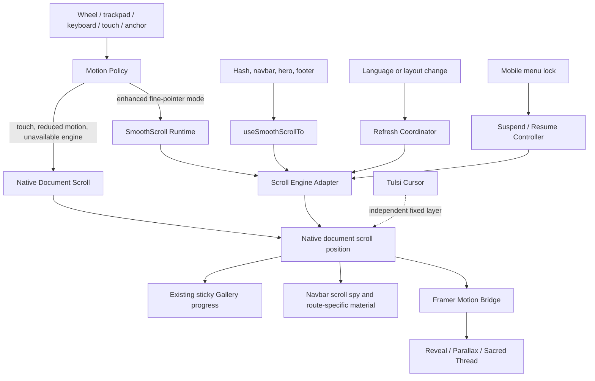
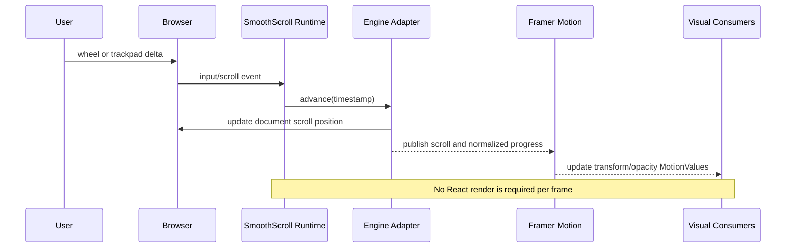
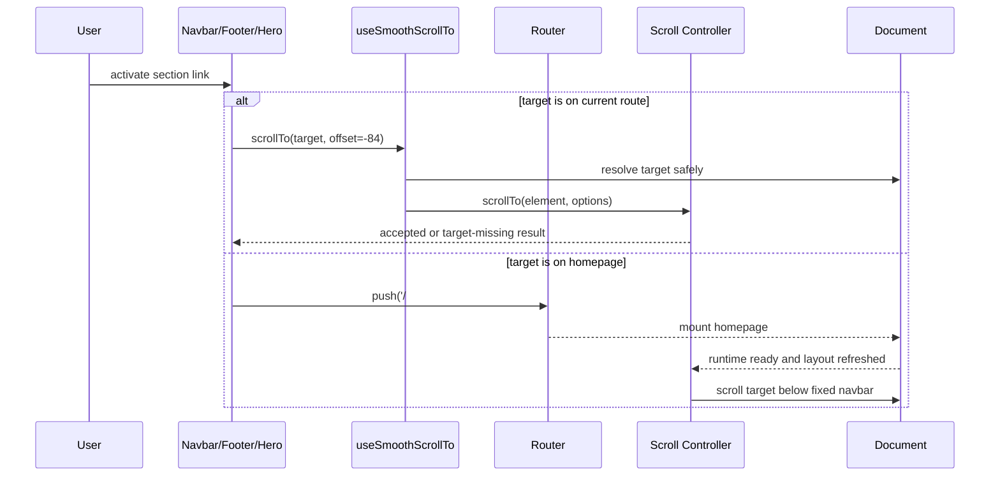
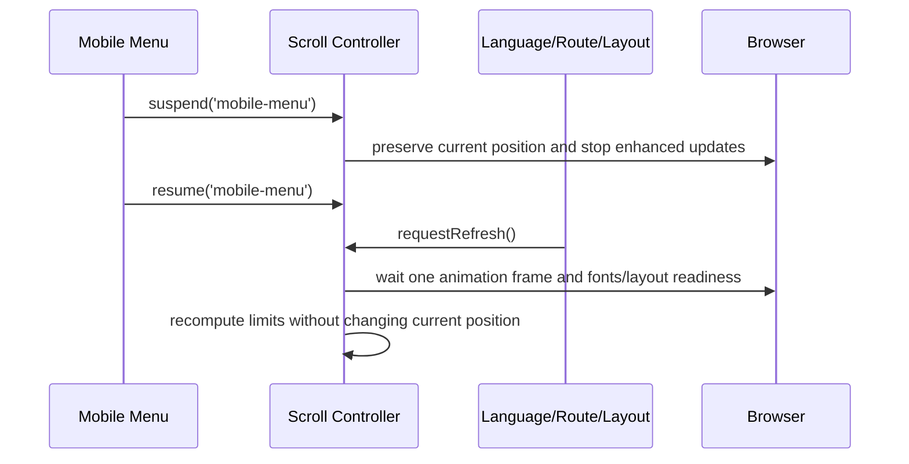

# Design Document: Smooth Scroll Animation

## Overview

The smooth-scroll-animation feature adds a calm, premium sense of continuity to the devotional site without changing document structure, content, navigation semantics, or native touch behavior. It preserves the existing `SmoothScroll` provider and `useSmoothScrollTo` adapter boundary, uses Framer Motion for bounded visual responses, and keeps the document itself as the scroll container so the navbar, custom Tulsi cursor, sticky gallery, anchors, browser history, and accessibility tools continue to work.

The recommended experience is a restrained combination of **Temple Glide** (moderate fine-pointer wheel smoothing), **Lotus Breath** (small one-shot content reveals), and **Sacred Thread** (an optional, inexpensive progress accent on large screens). Existing section photography receives only the current shallow parallax treatment. There is no section snapping, full-page transform, forced horizontal travel, wheel-distance amplification, or scroll-controlled scene takeover.

> Repository alignment note: `app/layout.tsx` already wraps content in `SmoothScroll`, and the README describes that boundary as Lenis-backed. In the inspected checkout, `components/SmoothScroll.tsx` currently delegates to native scrolling and neither `package.json` nor `package-lock.json` contains Lenis. This design therefore preserves a **Lenis-compatible adapter architecture** rather than requiring an unapproved package addition. If Lenis is available in the implementation target, the adapter uses it. Otherwise it remains native. Framer Motion remains the visual-motion layer in both cases.

## Experience Concepts and Decision

### Concept A — Temple Glide

A moderately damped wheel/trackpad response makes long transitions between the alternating photography sections feel continuous. It operates only on devices with a fine pointer, a sufficiently large viewport, and no reduced-motion preference. Touch, keyboard, scrollbar dragging, text search, and assistive navigation retain browser-native behavior.

### Concept B — Lotus Breath

Headings, cards, and selected media enter once with a short opacity transition and no more than 18px of vertical travel. A small stagger gives hierarchy without making bilingual content wait. Mobile uses at most 10px of travel and no blur; reduced motion renders final content immediately.

### Concept C — Sacred Thread

A 1px gold progress filament or existing ceremonial divider glow responds to normalized page progress. It is decorative, `aria-hidden`, driven by a MotionValue rather than React renders, and omitted on small screens. It provides orientation without covering the photography or competing with the Tulsi cursor.

### Concept D — Ceremonial Veil

A cream/maroon veil lifts from selected images or chapter boundaries once. This can be tasteful for one or two editorial moments, but applying it to every section would delay content and increase compositing cost. It remains an opt-in accent using the existing `VeilReveal` pattern, not the global scroll behavior.

### Concept E — Chapter Snap / Cinematic Scene Takeover

Each section snaps into place, pins, scales, or crossfades as a full-screen chapter. This creates a dramatic presentation but interferes with user-controlled reading pace, hash targets, sticky content, mobile inertia, keyboard navigation, and motion comfort. It is explicitly rejected.

| Concept | Visual effect | Performance | Mobile behavior | Accessibility | Implementation risk |
|---|---|---|---|---|---|
| Temple Glide | Buttery continuity with no scene takeover | Low when one RAF owner is used | Native touch inertia; enhancement disabled | Native keyboard/scrollbar semantics retained; disabled for reduced motion | Low–medium because runtime availability must be detected |
| Lotus Breath | Soft hierarchy and calm entrances | Low; opacity plus small transform only | Smaller travel, no blur, once-only | Final state is immediate for reduced motion; DOM order unchanged | Low; extends existing `Reveal` conventions |
| Sacred Thread | Subtle gold orientation cue | Very low; one composited scale | Hidden below 768px | Decorative and never the only location cue | Low |
| Ceremonial Veil | Editorial, ritual-like image reveal | Medium if repeated; may allocate layers | Selected media only; shorter duration | Must never obscure content for reduced motion | Medium |
| Chapter Snap | Dramatic full-screen chapters | Medium–high; sticky/full-page transforms | Conflicts with touch inertia | Highest motion-sickness and navigation risk | High; rejected |

### Recommendation

Adopt **Temple Glide + Lotus Breath**, with **Sacred Thread** as a compatible desktop accent. Keep the existing shallow background parallax and selected image veil, but do not increase their amplitude or frequency. This combination improves perceived polish while preserving reading control and the devotional visual hierarchy.

## Architecture

### System Context



### Architectural Rules

1. `window`/the document remains the canonical scroll container; neither `html`, `body`, nor the application root is translated.
2. `SmoothScroll` owns at most one enhanced-scroll engine and one animation-frame loop.
3. Consumers call `useSmoothScrollTo`; they do not import or inspect Lenis directly.
4. Framer Motion owns visual interpolation (`MotionValue`, `useScroll`, `useTransform`) and does not set the canonical scroll position.
5. Continuous values update outside React state. React state is reserved for discrete changes such as navbar mode or gallery selection.
6. The Tulsi cursor remains outside the `SmoothScroll` subtree and no ancestor transform changes fixed positioning.
7. Route-specific navbar behavior remains unchanged: home is bar-less only at the hero top; non-home routes remain glass/solid.
8. Language changes can alter line wrapping and section height but must not reset the current scroll position.
9. Existing sticky gallery behavior is not nested in a new pinning or snapping system.

### Component Responsibilities

| Component | Responsibility | Change boundary |
|---|---|---|
| `SmoothScroll` | Select runtime mode, provide controller, own lifecycle and refresh | Internal enhancement; public child composition remains unchanged |
| `useSmoothScrollTo` | Resolve safe targets and route calls through the controller/native fallback | Preserve current `(selector, offset)` compatibility; allow typed options later |
| `useMotionPolicy` | Combine reduced-motion, pointer, viewport, visibility, and engine availability | New internal hook; no visual output |
| `ScrollMotionBridge` | Publish normalized progress and scroll state as MotionValues | Optional internal child; no React render per frame |
| `Reveal`, `Stagger`, `StaggerItem` | Apply Lotus Breath tokens and reduced/mobile variants | Extend current props without changing content markup |
| `ParallaxScene` | Retain shallow background-only depth | Keep current desktop amplitudes as upper bounds; zero on mobile/reduced motion |
| `SacredScrollProgress` | Render optional desktop decorative progress | New optional `aria-hidden` component |
| `HashScroll` | Resolve cross-route hash after layout stabilizes | Replace fixed timing dependency with controller readiness/refresh contract |
| `Navbar` / `Footer` / `Hero` | Request target scroll and preserve 84px fixed-header clearance | No direct engine dependency |
| `LanguageProvider` integration | Trigger a measurement refresh after English/Hindi reflow | No content or translation changes |

## Sequence Diagrams

### Enhanced Desktop Scroll



### Same-Route and Cross-Route Anchor Navigation



### Reduced-Motion or Coarse-Pointer Session

```mermaid
sequenceDiagram
    participant P as Motion Policy
    participant S as SmoothScroll
    participant N as Native Browser
    participant V as Visual Components

    P->>S: reducedMotion=true or coarsePointer=true
    S->>N: choose native mode; do not create engine RAF
    P->>V: motion level = none/minimal
    V-->>N: render final visible state; parallax = 0
    Note over N,V: Touch inertia, keyboard, anchors, and scrollbar remain native
```

### Mobile Menu and Layout Reflow



## Components and Interfaces

### Scroll Controller Contract

```pascal
ENUM ScrollMode
  NATIVE
  ENHANCED
END ENUM

ENUM ScrollResult
  ACCEPTED
  TARGET_NOT_FOUND
  INVALID_TARGET
  CONTROLLER_UNAVAILABLE
END ENUM

VARIANT ScrollTarget
  Selector(value: String)
  Element(value: HTMLElement)
  AbsoluteY(value: Number)
END VARIANT

STRUCTURE ScrollToOptions
  offset: Number DEFAULT -84
  immediate: Boolean DEFAULT false
  updateHistory: Boolean DEFAULT false
  focusTarget: Boolean DEFAULT false
END STRUCTURE

STRUCTURE ScrollSnapshot
  y: Number
  limit: Number
  progress: Number
  direction: Number
  isScrolling: Boolean
  mode: ScrollMode
END STRUCTURE

INTERFACE ScrollController
  PROCEDURE scrollTo(target: ScrollTarget, options: ScrollToOptions) RETURNS ScrollResult
  PROCEDURE suspend(reason: String)
  PROCEDURE resume(reason: String)
  PROCEDURE requestRefresh(reason: String)
  PROCEDURE subscribe(listener: PROCEDURE(ScrollSnapshot)) RETURNS Unsubscribe
  PROCEDURE destroy()
END INTERFACE
```

### Motion Policy and Configuration

```pascal
STRUCTURE MotionCapabilities
  reducedMotion: Boolean
  coarsePointer: Boolean
  finePointer: Boolean
  viewportWidth: Number
  documentVisible: Boolean
  enhancedEngineAvailable: Boolean
END STRUCTURE

STRUCTURE MotionPolicy
  scrollMode: ScrollMode
  revealTravel: Number
  revealBlur: Number
  parallaxEnabled: Boolean
  progressEnabled: Boolean
  continuousMotionEnabled: Boolean
END STRUCTURE

STRUCTURE SmoothScrollConfig
  desktopMinWidth: Number DEFAULT 768
  lerp: Number DEFAULT 0.09
  wheelMultiplier: Number DEFAULT 0.90
  touchSmoothing: Boolean DEFAULT false
  syncTouch: Boolean DEFAULT false
  anchorOffset: Number DEFAULT -84
  frameDeltaCapMs: Number DEFAULT 64
END STRUCTURE

STRUCTURE MotionTokens
  devotionalEase: CubicBezier DEFAULT (0.22, 1.00, 0.36, 1.00)
  revealDurationDesktopMs: Number DEFAULT 820
  revealDurationMobileMs: Number DEFAULT 560
  revealTravelDesktopPx: Number DEFAULT 18
  revealTravelMobilePx: Number DEFAULT 10
  revealStaggerMs: Number DEFAULT 70
  revealBlurDesktopPx: Number DEFAULT 4
  revealBlurMobilePx: Number DEFAULT 0
  progressResponseMs: Number DEFAULT 120
  parallaxMaxDefaultPx: Number DEFAULT 36
  parallaxMaxHeroPx: Number DEFAULT 42
END STRUCTURE
```

`lerp` and a duration-based engine mode are not used simultaneously. The adapter maps these intent-level values to the installed engine version. Wheel distance is never amplified above the existing physical input; touch smoothing remains off.

### Hook and Component Interfaces

```pascal
HOOK useMotionPolicy() RETURNS MotionPolicy

HOOK useScrollController() RETURNS ScrollController

HOOK useSmoothScrollTo()
  RETURNS PROCEDURE(
    target: ScrollTarget OR String,
    offsetOrOptions: Number OR ScrollToOptions OPTIONAL
  ) RETURNS ScrollResult
END HOOK

HOOK useScrollRefresh(layoutRevision: String)
  // Requests one coalesced measurement refresh after route/language reflow.
END HOOK

COMPONENT ScrollMotionBridge
  INPUT controller: ScrollController
  OUTPUT scrollY: MotionValue<Number>
  OUTPUT progress: MotionValue<Number>
  OUTPUT isScrolling: MotionValue<Boolean>
END COMPONENT

COMPONENT SacredScrollProgress
  INPUT progress: MotionValue<Number>
  INPUT placement: "navbar" OR "viewport-edge" DEFAULT "navbar"
  INPUT minViewportWidth: Number DEFAULT 768
  BEHAVIOR decorative, pointer-events none, aria-hidden true
END COMPONENT

COMPONENT Reveal
  INPUT children: ReactNode
  INPUT delay: Number DEFAULT 0
  INPUT y: Number DEFAULT policy.revealTravel
  INPUT duration: Number DEFAULT token duration
  INPUT blur: Boolean DEFAULT false
  INPUT once: Boolean DEFAULT true
  INPUT as: SemanticElement DEFAULT "div"
END COMPONENT

COMPONENT ParallaxScene
  INPUT children: ReactNode
  INPUT amount: Number DEFAULT 36
  INPUT mobileAmount: Number DEFAULT 0
  CONSTRAINT absolute(amount) <= 42
END COMPONENT
```

## Data Models and Validation Rules

### Resolved Target

```pascal
STRUCTURE ResolvedTarget
  element: HTMLElement OPTIONAL
  absoluteY: Number
  requestedOffset: Number
  clampedY: Number
END STRUCTURE
```

Validation rules:
- Selector strings must represent a local element ID or a trusted static selector supplied by application code.
- Hash values are decoded defensively and resolved with `getElementById`; malformed hashes do not reach an unsafe selector parser.
- `absoluteY` must be finite.
- `clampedY = CLAMP(absoluteY + requestedOffset, 0, documentScrollLimit)`.
- A missing target returns a result and performs no movement.

### Suspension State

```pascal
STRUCTURE SuspensionState
  reasons: Set<String>
  positionAtFirstSuspend: Number OPTIONAL
END STRUCTURE
```

Validation rules:
- Suspension is reference-counted by distinct reason, not represented by one fragile Boolean.
- Scrolling resumes only when the reason set is empty.
- Repeated suspension with the same reason is idempotent.

### Runtime State

```pascal
STRUCTURE RuntimeState
  mode: ScrollMode
  controllerReady: Boolean
  destroyed: Boolean
  rafId: Number OPTIONAL
  refreshPending: Boolean
  subscriptions: Set<Unsubscribe>
  suspension: SuspensionState
END STRUCTURE
```

Validation rules:
- At most one active `rafId` belongs to a runtime instance.
- A destroyed runtime cannot publish or schedule work.
- Progress is always finite and in the closed interval `[0, 1]`.

## Algorithmic Pseudocode

### Select Motion Policy

```pascal
ALGORITHM selectMotionPolicy(capabilities)
INPUT: capabilities of type MotionCapabilities
OUTPUT: policy of type MotionPolicy

BEGIN
  IF capabilities.reducedMotion THEN
    RETURN MotionPolicy(
      scrollMode = NATIVE,
      revealTravel = 0,
      revealBlur = 0,
      parallaxEnabled = false,
      progressEnabled = false,
      continuousMotionEnabled = false
    )
  END IF

  IF capabilities.coarsePointer OR capabilities.viewportWidth < 768 THEN
    RETURN MotionPolicy(
      scrollMode = NATIVE,
      revealTravel = 10,
      revealBlur = 0,
      parallaxEnabled = false,
      progressEnabled = false,
      continuousMotionEnabled = true
    )
  END IF

  IF capabilities.finePointer AND capabilities.enhancedEngineAvailable THEN
    RETURN MotionPolicy(
      scrollMode = ENHANCED,
      revealTravel = 18,
      revealBlur = 4,
      parallaxEnabled = true,
      progressEnabled = true,
      continuousMotionEnabled = true
    )
  END IF

  RETURN MotionPolicy(
    scrollMode = NATIVE,
    revealTravel = 18,
    revealBlur = 4,
    parallaxEnabled = true,
    progressEnabled = true,
    continuousMotionEnabled = true
  )
END
```

### Initialize the Runtime

```pascal
ALGORITHM initializeScrollRuntime(config, capabilities)
INPUT: validated config and current capabilities
OUTPUT: initialized ScrollController

BEGIN
  policy <- selectMotionPolicy(capabilities)
  state <- new RuntimeState(mode = policy.scrollMode)
  nativeAdapter <- createNativeAdapter(window)

  IF policy.scrollMode = ENHANCED THEN
    engine <- createAvailableEngineAdapter(config)
  ELSE
    engine <- nativeAdapter
  END IF

  controller <- createController(engine, nativeAdapter, state)
  subscribeToReducedMotionChanges(controller)
  subscribeToPointerAndViewportChanges(controller)
  subscribeToVisibilityChanges(controller)

  IF policy.scrollMode = ENHANCED THEN
    state.rafId <- REQUEST_ANIMATION_FRAME(frame)
  END IF

  state.controllerReady <- true
  RETURN controller

  PROCEDURE frame(timestamp)
    IF state.destroyed THEN
      RETURN
    END IF

    IF state.suspension.reasons IS EMPTY AND document IS visible THEN
      engine.advance(timestamp, config.frameDeltaCapMs)
    END IF

    state.rafId <- REQUEST_ANIMATION_FRAME(frame)
  END PROCEDURE
END
```

### Resolve and Scroll to a Target

```pascal
ALGORITHM scrollToTarget(controller, target, options)
INPUT: live controller, ScrollTarget, validated ScrollToOptions
OUTPUT: ScrollResult

BEGIN
  IF controller IS unavailable OR controller IS destroyed THEN
    RETURN CONTROLLER_UNAVAILABLE
  END IF

  resolved <- resolveTargetWithoutThrowing(target)
  IF resolved IS invalid THEN
    RETURN INVALID_TARGET
  END IF
  IF resolved IS missing THEN
    RETURN TARGET_NOT_FOUND
  END IF

  limit <- MAX(0, document.scrollHeight - viewport.height)
  destination <- CLAMP(resolved.absoluteY + options.offset, 0, limit)

  IF currentPolicy.reducedMotion OR options.immediate THEN
    nativeAdapter.scrollTo(destination, behavior = AUTO)
  ELSE
    controller.activeAdapter.scrollTo(destination, easing = DEVOTIONAL_EASE)
  END IF

  IF options.updateHistory THEN
    updateLocalHashWithoutFullNavigation(resolved.element.id)
  END IF

  IF options.focusTarget THEN
    focusTargetAfterSettleWithoutVisibleJump(resolved.element)
  END IF

  RETURN ACCEPTED
END
```

### Coalesced Layout Refresh

```pascal
ALGORITHM requestLayoutRefresh(controller, reason)
INPUT: live controller and diagnostic reason
OUTPUT: none

BEGIN
  IF controller IS destroyed OR controller.refreshPending THEN
    RETURN
  END IF

  controller.refreshPending <- true
  preservedY <- window.scrollY

  REQUEST_ANIMATION_FRAME(PROCEDURE()
    WAIT until currently loaded fonts are settled OR timeout is reached

    IF controller IS destroyed THEN
      RETURN
    END IF

    controller.activeAdapter.resize()
    nativeAdapter.scrollTo(CLAMP(preservedY, 0, currentScrollLimit), behavior = AUTO)
    controller.refreshPending <- false
  END PROCEDURE)
END
```

### Suspend and Resume

```pascal
ALGORITHM suspend(controller, reason)
BEGIN
  IF reason IS empty OR controller IS destroyed THEN
    RETURN
  END IF

  IF controller.suspension.reasons IS EMPTY THEN
    controller.suspension.positionAtFirstSuspend <- window.scrollY
    controller.activeAdapter.stop()
  END IF

  ADD reason TO controller.suspension.reasons
END

ALGORITHM resume(controller, reason)
BEGIN
  REMOVE reason FROM controller.suspension.reasons

  IF controller.suspension.reasons IS EMPTY AND NOT controller.destroyed THEN
    controller.activeAdapter.start()
    controller.requestRefresh("resume:" + reason)
  END IF
END
```

### Destroy the Runtime

```pascal
ALGORITHM destroyScrollRuntime(controller)
BEGIN
  IF controller.destroyed THEN
    RETURN
  END IF

  controller.destroyed <- true

  IF controller.rafId EXISTS THEN
    CANCEL_ANIMATION_FRAME(controller.rafId)
    controller.rafId <- NONE
  END IF

  FOR EACH unsubscribe IN controller.subscriptions DO
    unsubscribe()
  END FOR

  controller.subscriptions <- EMPTY_SET
  controller.activeAdapter.destroy()
  controller.suspension.reasons <- EMPTY_SET
  controller.refreshPending <- false
  restoreNativeDocumentStyles()
END
```

**Loop invariant:** Before and after each subscription cleanup iteration, every already-visited subscription has been invoked exactly once, no unvisited subscription has been invoked by this loop, and the controller remains marked destroyed.

## Key Functions with Formal Specifications

### `selectMotionPolicy(capabilities)`

```pascal
FUNCTION selectMotionPolicy(capabilities: MotionCapabilities) RETURNS MotionPolicy
```

**Preconditions**
- `viewportWidth` is finite and non-negative.
- Capability flags describe the current media-query state.

**Postconditions**
- Reduced motion always implies native mode, zero reveal travel/blur, no parallax, and no decorative progress.
- Coarse pointer or width below 768px always implies native scroll mode.
- Enhanced mode is returned only when a fine pointer and an available enhanced engine are both present.
- The function has no side effects.

**Loop invariants:** N/A.

### `scrollToTarget(controller, target, options)`

```pascal
FUNCTION scrollToTarget(controller, target, options) RETURNS ScrollResult
```

**Preconditions**
- Options contain finite numeric values.
- The controller may be unavailable or destroyed; this is represented in the result rather than thrown.

**Postconditions**
- An accepted destination is in `[0, documentScrollLimit]`.
- If the target is missing or invalid, scroll position and history are unchanged.
- Reduced-motion navigation uses immediate native movement.
- With a present target, the settled target top is within 2 CSS px of the requested offset, unless clamped at a document boundary.

**Loop invariants:** N/A.

### `requestLayoutRefresh(controller, reason)`

```pascal
PROCEDURE requestLayoutRefresh(controller, reason)
```

**Preconditions**
- May be called repeatedly during route, font, image, resize, or language reflow.

**Postconditions**
- Multiple calls before the next refresh are coalesced into one measurement pass.
- Current scroll position is preserved, except where the new document limit requires clamping.
- No refresh runs after destruction.

**Loop invariants:** N/A.

### `normalizeProgress(y, limit)`

```pascal
FUNCTION normalizeProgress(y: Number, limit: Number) RETURNS Number
```

**Preconditions**
- `y` and `limit` are finite.

**Postconditions**
- Result is finite and lies in `[0, 1]`.
- If `limit <= 0`, result is `0`.
- For fixed positive `limit`, the result is monotonic non-decreasing as `y` increases.

**Loop invariants:** N/A.

### `destroyScrollRuntime(controller)`

```pascal
PROCEDURE destroyScrollRuntime(controller)
```

**Preconditions**
- May be called zero, one, or multiple times under React Strict Mode lifecycle behavior.

**Postconditions**
- No owned RAF, listener, observer, timer, or engine subscription remains active.
- Native document styles and scrolling remain usable.
- Repeated calls have no additional observable effect.

**Loop invariants**
- Each visited cleanup callback has executed exactly once in the current destruction pass.

## Example Usage

```pascal
COMPONENT RootLayout
  LanguageProvider
    SmoothScroll(config = DEFAULT_RESTRAINED_CONFIG)
      SacredParticles
      Navbar
      RouteContent
      SacredScrollProgress OPTIONAL
    END SmoothScroll
    TulsiCursor
    PWAClient
    AmbientSoundscape
  END LanguageProvider
END COMPONENT

COMPONENT Navbar
  scrollTo <- useSmoothScrollTo()

  ON homeSectionActivated(targetId)
    result <- scrollTo(Selector(targetId), ScrollToOptions(offset = -84))
    IF result = TARGET_NOT_FOUND THEN
      // Keep navigation usable; do not throw or lock scrolling.
      navigateTo("/" + targetId)
    END IF
  END ON
END COMPONENT

COMPONENT LocalizedPage
  language <- useLanguage()
  pathname <- usePathname()
  useScrollRefresh(pathname + ":" + language)
  RENDER bilingual content without animation-specific wrappers around text nodes
END COMPONENT

COMPONENT AboutSection
  Reveal(y = policy default, duration = token default, once = true)
    SectionHeading
  END Reveal

  ParallaxScene(amount = 36, mobileAmount = 0)
    BackgroundPhotography
  END ParallaxScene
END COMPONENT
```

## Correctness Properties

1. **Reduced-motion dominance**  
   For every capability set `c`, if `c.reducedMotion = true`, then `selectMotionPolicy(c).scrollMode = NATIVE`, reveal travel is `0`, blur is `0`, parallax is disabled, and no enhanced RAF is created.

2. **Mobile native-scroll preservation**  
   For every capability set `c`, if `c.coarsePointer = true` or `c.viewportWidth < 768`, then enhanced scroll is not selected, regardless of engine availability.

3. **Target accuracy and boundedness**  
   For every valid target `t`, finite offset `o`, and document limit `L`, the chosen destination equals `CLAMP(position(t) + o, 0, L)`; after settling it differs by at most 2 CSS px unless layout changes again.

4. **Invalid-target non-interference**  
   For every missing or malformed target, invoking `scrollToTarget` does not change scroll position, focus, history, or controller suspension state.

5. **Progress boundedness and monotonicity**  
   For all finite `y` and `L`, `normalizeProgress(y, L)` is in `[0,1]`; for fixed `L > 0` and `y1 <= y2`, `normalizeProgress(y1,L) <= normalizeProgress(y2,L)`.

6. **Single-frame-loop ownership**  
   For every mounted runtime instance, the number of active runtime-owned animation-frame callbacks is at most one; after destruction it is zero.

7. **Cleanup idempotence**  
   For every runtime, invoking `destroy` any positive number of times yields the same final state: no owned listeners, observers, subscriptions, timers, RAF callbacks, or engine instance remain.

8. **Suspension safety**  
   For every sequence of suspend/resume calls, the engine runs if and only if the suspension reason set is empty, the document is visible, and the runtime is not destroyed.

9. **Language-layout stability**  
   For every English/Hindi switch at scroll position `y`, refresh preserves `y` within 2 CSS px unless the new document limit is below `y`, in which case it preserves `newLimit`.

10. **Route and navbar invariance**  
    For every pathname other than `/`, the scroll feature does not make the navbar enter the home hero bar-less state; for `/`, the existing `scrollY > 56` and section-background rules remain authoritative.

11. **Content visibility invariant**  
    For every revealable element and every reduced-motion session, the element is rendered in its final visible state without waiting for viewport intersection.

12. **Root geometry preservation**  
    For every runtime mode, `html`, `body`, and the application root receive no scrolling transform; therefore fixed cursor, fixed navbar, sticky gallery, focus geometry, and section photography retain document-coordinate behavior.

13. **No per-frame React render requirement**  
    For every continuous scroll frame, progress and decorative transforms can update through MotionValues/imperative adapter values without requiring React state changes.

14. **Fallback availability**  
    For every session where an enhanced engine is absent or initialization fails, native wheel, touch, keyboard, scrollbar, and programmatic target scrolling remain available.

## Error Handling

### Enhanced Engine Missing

**Condition:** The documented Lenis-compatible runtime is not installed or cannot be loaded.  
**Response:** Select the native adapter and retain Framer Motion visual behavior permitted by policy.  
**Recovery:** None required; log only in development. Do not dynamically download or silently add a dependency.

### Engine Initialization Failure

**Condition:** Adapter construction throws or required browser APIs are unavailable.  
**Response:** Tear down any partial listeners and switch atomically to native mode.  
**Recovery:** Native scrolling remains immediately usable.

### Missing or Malformed Hash Target

**Condition:** A URL hash is empty, malformed, or references no mounted element.  
**Response:** Return `INVALID_TARGET` or `TARGET_NOT_FOUND`; do not throw from an effect.  
**Recovery:** Leave the page at its current position; a later route/layout readiness event may retry once for a valid ID.

### Dynamic Reflow During Scroll

**Condition:** Hindi font loading, image sizing, route content, or responsive layout changes the document limit.  
**Response:** Coalesce a refresh and clamp the preserved position.  
**Recovery:** Recalculate progress and target bounds without a visible reset to the top.

### Mobile Menu Lock

**Condition:** The menu opens while enhanced scrolling is active.  
**Response:** Suspend with reason `mobile-menu` before/with body overflow lock.  
**Recovery:** Resume only after unlock, refresh measurements, and preserve the prior position.

### Tab Becomes Hidden

**Condition:** `document.hidden` becomes true.  
**Response:** Stop advancing the enhanced engine and avoid accumulating frame delta.  
**Recovery:** On visibility, reset timing, refresh, and continue without a jump.

### Runtime Capability Change

**Condition:** Reduced-motion, pointer capability, or viewport policy changes while mounted.  
**Response:** Re-evaluate policy and atomically migrate between enhanced/native adapters.  
**Recovery:** Preserve current position and do not replay reveal animations.

## Testing Strategy

### Unit Testing

- Exercise the full policy matrix: reduced motion, coarse/fine pointer, widths around 768px, engine available/unavailable, and visibility.
- Verify target resolution, `-84px` navbar offset, boundary clamping, malformed hashes, and missing elements.
- Verify normalized progress for zero/negative limits, large values, and monotonic sequences.
- Verify suspension reason-set behavior and idempotent cleanup with fake RAF/listener adapters.
- Verify motion token selection for desktop, mobile, and reduced motion.

### Property-Based Testing

Use deterministic generated cases in the existing test harness so the feature does not require a new package. If the project later adopts a property-testing library, use its pinned approved version; do not add one solely for this feature.

Generate:
- finite scroll positions, limits, and offsets for clamping and progress properties;
- arbitrary suspend/resume operation sequences for suspension safety;
- arbitrary capability combinations for policy dominance;
- arbitrary mount/destroy sequences for lifecycle idempotence;
- English/Hindi layout-height pairs for preserved-position clamping.

### Component Testing

- Mock `matchMedia`, `requestAnimationFrame`, visibility, `ResizeObserver`, and the engine adapter.
- Assert reduced-motion content has no hidden initial state.
- Assert `SacredScrollProgress` is decorative and absent/disabled on small screens.
- Assert language and pathname revisions coalesce refreshes.
- Assert the custom cursor remains outside any transformed ancestor.

### Integration Testing

- Navigate from `/gaudiya-heritage` to `/#about`, verify target clearance and the non-home/home navbar transition.
- Exercise navbar, hero CTA, footer links, direct hash load, browser back/forward, keyboard Home/End/PageDown, and scrollbar dragging.
- Open/close the mobile menu mid-page and verify no position jump or stale lock.
- Switch English/Hindi near the gallery and footer and verify no top reset.
- Verify the existing Gallery sticky selection/progress and section parallax remain independent.
- Verify native touch scrolling and horizontal gallery thumbnail scrolling are not intercepted.

### Visual and Accessibility Testing

- Test at 320px, 390px, 768px, 1024px, and 1440px in both languages.
- Test OS/browser reduced-motion before page load and while the page is open.
- Confirm focus rings, skip/anchor focus, text selection, find-in-page, zoom to 200%, and screen-reader reading order.
- Check that no reveal delays reading by more than its stated duration and that content remains visible when JavaScript fails.
- Conduct motion-comfort review: no oscillation, no scale on full sections, no repeated blur, and no opposing foreground/background travel.

### Performance Validation

- Profile a complete homepage scroll on representative desktop and mid-range mobile hardware.
- Target no feature-attributable long task over 50ms during steady scrolling.
- Keep continuous scroll handlers at or below one coalesced update per animation frame.
- Target less than 2ms scripting work per steady-state frame for the scroll feature and no feature-attributable layout shift.
- Confirm layer count does not grow as sections are traversed and `will-change` is limited to actively animated decorative/background elements.

## Performance Considerations

- Prefer opacity and `translate3d` on isolated children; do not animate layout properties.
- Keep parallax at the existing maximum of 36px (42px hero), zero on mobile/reduced motion.
- Do not apply blur continuously; optional reveal blur is at most 4px and one-shot.
- Use one controller publication stream and MotionValues instead of independent raw scroll listeners where practical.
- Pause enhanced advancement while hidden or suspended and cap elapsed frame delta after stalls.
- Avoid `backdrop-filter` changes during scrolling; existing navbar material may transition only at its current discrete threshold.
- Do not promote every section permanently. Remove or avoid `will-change` when motion is disabled.
- Preserve the capped particle cadence and pointer-event-based Tulsi cursor; neither joins the scroll frame loop.

## Accessibility Considerations

- Reduced motion overrides every enhancement, including CSS `scroll-behavior`; target navigation becomes immediate.
- Mobile/coarse-pointer sessions retain native inertia and overscroll behavior.
- Keyboard, scrollbar, browser search, anchor history, zoom, and focus are never intercepted.
- Decorative progress and parallax are `aria-hidden`/non-semantic; they communicate no exclusive information.
- Reveals never change DOM order, accessible names, language, or live-region behavior.
- Hindi text may reflow independently; animation wrappers do not split words or Devanagari grapheme clusters.

## Security and Privacy Considerations

- The feature performs no analytics, persistence, remote requests, or input recording.
- Hash targets are resolved defensively with local ID lookup; arbitrary strings are not evaluated or injected.
- Development diagnostics must not include page content or user input.
- Dependency drift is handled by fallback, not by runtime CDN loading.

## Dependencies

### Existing

- React and Next.js App Router for provider lifecycle and route awareness.
- Framer Motion for `useReducedMotion`, viewport reveals, MotionValues, `useScroll`, and transforms.
- Browser APIs: `requestAnimationFrame`, `matchMedia`, `IntersectionObserver`, `ResizeObserver` where available, Page Visibility, and native scrolling.

### Enhanced Scroll Engine Boundary

- Preserve the documented Lenis-compatible adapter behind `SmoothScroll` when the target branch already provides it.
- The inspected checkout does **not** currently declare Lenis. This feature specification does not authorize adding it.
- No component outside `SmoothScroll` may depend on an engine package or engine-specific types.

### New Dependencies

None required. Any proposal to add or restore an enhanced-scroll package must be a separate explicit decision with an exact pinned version, bundle/performance review, and native fallback retained.
